介绍docker的前世今生，了解docker的实现原理，以包含Java、Django、前端等多个项目为例，带大家如何编写最佳的Dockerfile构建镜像。通过本章的学习，大家会知道docker的概念及基本操作，并学会构建自己的业务镜像，并通过抓包的方式掌握Docker最常用的bridge网络模式的通信。

#### [认识docker](http://49.7.203.222:2023/#/docker/introduction?id=认识docker)

###### [为什么出现docker](http://49.7.203.222:2023/#/docker/introduction?id=为什么出现docker)

需要一种轻量、高效的虚拟化能力


Docker 公司位于旧金山,原名dotCloud，底层利用了Linux容器技术（LXC）（在操作系统中实现资源隔离与限制）。为了方便创建和管理这些容器，dotCloud 开发了一套内部工具，之后被命名为“Docker”。Docker就是这样诞生的。

Hypervisor： 一种运行在基础物理服务器和操作系统之间的中间软件层，可允许多个操作系统和应用共享硬件 。常见的VMware的 Workstation 、ESXi、微软的Hyper-V或者思杰的XenServer。

Container Runtime：通过Linux内核虚拟化能力管理多个容器，多个容器共享一套操作系统内核。因此摘掉了内核占用的空间及运行所需要的耗时，使得容器极其轻量与快速。Docker是其中最知名的一种容器Container Runtime，其他的还有 CoreOS容器Rkt ，Podman。

###### [docker能做什么](http://49.7.203.222:2023/#/docker/introduction?id=docker能做什么)

基于轻量的特性，解决软件交付过程中的环境依赖

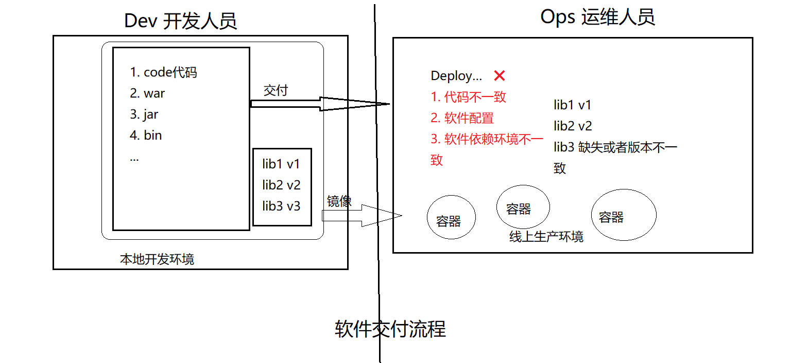

*思考： 基于docker容器部署应用和虚拟机部署应用最大的区别？*

简单总结：

- 可以把应用程序代码及运行依赖环境打包成镜像，作为交付介质，在各环境部署
- 可以将镜像（image）启动成为容器(container)，并且提供多容器的生命周期进行管理（启、停、删）
- container容器之间相互隔离，且每个容器可以设置资源限额
- 提供轻量级虚拟化功能，容器就是在宿主机中的一个个的虚拟的空间，彼此相互隔离，完全独立

###### [什么是docker](http://49.7.203.222:2023/#/docker/introduction?id=什么是docker)

基于操作系统内核，提供轻量级虚拟化功能的CS架构的软件产品。


###### [版本管理](http://49.7.203.222:2023/#/docker/introduction?id=版本管理)

- Docker 引擎主要有两个版本：企业版（EE）和社区版（CE）
- 每个季度(1-3,4-6,7-9,10-12)，企业版和社区版都会发布一个稳定版本(Stable)。社区版本会提供 4 个月的支持，而企业版本会提供 12 个月的支持
- 每个月社区版还会通过 Edge 方式发布月度版
- 从 2017 年第一季度开始，Docker 版本号遵循 YY.MM-xx 格式，类似于 Ubuntu 等项目。例如，2018 年 6 月第一次发布的社区版本为 18.06.0-ce

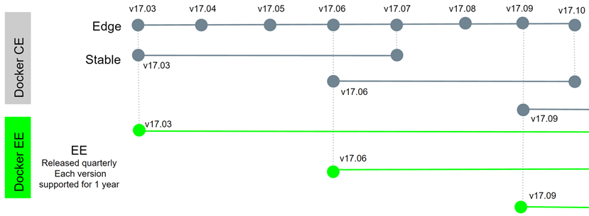

###### [发展史](http://49.7.203.222:2023/#/docker/introduction?id=发展史)

13年成立，15年开始，迎来了飞速发展。

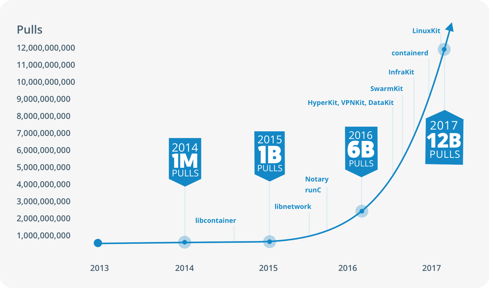

Docker 1.8之前，使用[LXC](https://linuxcontainers.org/lxc/introduction/)，Docker在上层做了封装， 把LXC复杂的容器创建与使用方式简化为自己的一套命令体系。

之后，为了实现跨平台等复杂的场景，Docker抽出了libcontainer项目，把对namespace、cgroup的操作封装在libcontainer项目里，支持不同的平台类型。

2015年6月，Docker牵头成立了 OCI（Open Container Initiative开放容器计划）组织，这个组织的目的是建立起一个围绕容器的通用标准 。 容器格式标准是一种不受上层结构绑定的协议，即不限于某种特定操作系统、硬件、CPU架构、公有云等 ， 允许任何人在遵循该标准的情况下开发应用容器技术，这使得容器技术有了一个更广阔的发展空间。

OCI成立后，libcontainer 交给OCI组织来维护，但是libcontainer中只包含了与kernel交互的库，因此基于libcontainer项目，后面又加入了一个CLI工具，并且项目改名为runC (https://github.com/opencontainers/runc )， 目前runC已经成为一个功能强大的runtime工具。

Docker也做了架构调整。将容器运行时相关的程序从docker daemon剥离出来，形成了**containerd**。containerd向上为Docker Daemon提供了`gRPC接口`，使得Docker Daemon屏蔽下面的结构变化，确保原有接口向下兼容。向下通过`containerd-shim`结合`runC`，使得引擎可以独立升级，避免之前Docker Daemon升级会导致所有容器不可用的问题。


也就是说

- runC（libcontainer）是符合OCI标准的一个实现，与底层系统交互
- containerd是实现了OCI之上的容器的高级功能，比如镜像管理、容器执行的调用等
- Dockerd目前是最上层与CLI交互的进程，接收cli的请求并与containerd协作

###### [小结](http://49.7.203.222:2023/#/docker/introduction?id=小结)

1. 为了提供一种更加轻量的虚拟化技术，docker出现了
2. 借助于docker容器的轻、快等特性，解决了软件交付过程中的环境依赖问题，使得docker得以快速发展
3. Docker是一种CS架构的软件产品，可以把代码及依赖打包成镜像，作为交付介质，并且把镜像启动成为容器，提供容器生命周期的管理
4. docker-ce，每季度发布stable版本。18.06，18.09，19.03
5. 发展至今，docker已经通过制定OCI标准对最初的项目做了拆分，其中runC和containerd是docker的核心项目，理解docker整个请求的流程，对我们深入理解docker有很大的帮助


#### [安装](http://49.7.203.222:2023/#/docker/install?id=安装)

###### [配置宿主机网卡转发](http://49.7.203.222:2023/#/docker/install?id=配置宿主机网卡转发)

```bash
## 若未配置，需要执行如下
$ cat <<EOF >  /etc/sysctl.d/docker.conf
net.bridge.bridge-nf-call-ip6tables = 1
net.bridge.bridge-nf-call-iptables = 1
net.ipv4.ip_forward=1
EOF
$ sysctl -p /etc/sysctl.d/docker.conf
```

###### [Yum安装配置docker](http://49.7.203.222:2023/#/docker/install?id=yum安装配置docker)

```bash
## 下载阿里源repo文件
$ curl -o /etc/yum.repos.d/Centos-7.repo http://mirrors.aliyun.com/repo/Centos-7.repo
$ curl -o /etc/yum.repos.d/docker-ce.repo http://mirrors.aliyun.com/docker-ce/linux/centos/docker-ce.repo

$ yum clean all && yum makecache
## yum安装
$ yum install docker-ce-20.10.18 -y
## 查看源中可用版本
$ yum list docker-ce --showduplicates | sort -r
## 安装旧版本
##yum install -y docker-ce-18.09.9

## 配置源加速
## https://cr.console.aliyun.com/cn-hangzhou/instances/mirrors
mkdir -p /etc/docker
vi /etc/docker/daemon.json
{
  "registry-mirrors" : [
    "https://8xpk5wnt.mirror.aliyuncs.com"
  ]
}

## 设置开机自启
systemctl enable docker  
systemctl daemon-reload

## 启动docker
systemctl start docker 

## 查看docker信息
docker info

## docker-client
which docker
## docker daemon
ps aux |grep docker
## containerd
ps aux|grep containerd
systemctl status containerd
```


#### [核心要素及常用操作详解](http://49.7.203.222:2023/#/docker/common-operation?id=核心要素及常用操作详解)


三大核心要素：镜像(Image)、容器(Container)、仓库(Registry)

###### [镜像（Image）](http://49.7.203.222:2023/#/docker/common-operation?id=镜像（image）)

打包了业务代码及运行环境的包，是静态的文件，不能直接对外提供服务。

###### [容器（Container）](http://49.7.203.222:2023/#/docker/common-operation?id=容器（container）)

镜像的运行时，可以对外提供服务。

###### [仓库（Registry）](http://49.7.203.222:2023/#/docker/common-operation?id=仓库（registry）)

存放镜像的地方

- 公有仓库，Docker Hub，阿里，网易...
- 私有仓库，企业内部搭建
  - Docker Registry，Docker官方提供的镜像仓库存储服务
  - Harbor, 是Docker Registry的更高级封装，它除了提供友好的Web UI界面，角色和用户权限管理，用户操作审计等功能
- 镜像访问地址形式 registry.devops.com/demo/hello:latest,若没有前面的url地址，则默认寻找Docker Hub中的镜像，若没有tag标签，则使用latest作为标签。 比如，docker pull nginx，会被解析成docker.io/library/nginx:latest
- 公有的仓库中，一般存在这么几类镜像
  - 操作系统基础镜像（centos，ubuntu，suse，alpine）
  - 中间件（nginx，redis，mysql，tomcat）
  - 语言编译环境（python，java，golang）
  - 业务镜像（django-demo...）

容器和仓库不会直接交互，都是以镜像为载体来操作。

1. 查看镜像列表

   ```bash
   $ docker images
   ```

2. 如何获取镜像

   - 从远程仓库拉取

     ```bash
     # 推荐alpine
     $ docker pull nginx:alpine
     $ docker images
     ```

   - 使用tag命令

     ```bash
     $ docker tag nginx:alpine 172.21.51.143:5000/nginx:alpine
     $ docker images
     ```

   - 本地构建

     ```bash
     $ docker build . -t my-nginx:ubuntu -f Dockerfile
     ```

3. 如何通过镜像启动容器

   ```bash
   $ docker run --name my-nginx-alpine -d nginx:alpine
   ```

4. 如何知道容器内部运行了什么程序？

   ```bash
   # 进入容器内部,分配一个tty终端
   $ docker exec -ti my-nginx-alpine /bin/sh
   # ps aux
   ```

5. docker怎么知道容器启动后该执行什么命令？

   通过docker build来模拟构建一个nginx的镜像，

   - 创建Dockerfile

     ```dockerfile
     # 告诉docker使用哪个基础镜像作为模板，后续命令都以这个镜像为基础 
     FROM ubuntu
     
     # 替换源
     RUN sed -i 's/archive.ubuntu.com/mirrors.ustc.edu.cn/g' /etc/apt/sources.list && sed -i 's/security.ubuntu.com/mirrors.ustc.edu.cn/g' /etc/apt/sources.list
     
     # RUN命令会在上面指定的镜像里执行命令 
     RUN apt-get update && apt install -y nginx
     
     #告诉docker，启动容器时执行如下命令
     CMD ["/usr/sbin/nginx", "-g","daemon off;"]
     ```

   - 构建本地镜像

     ```bash
     $ docker build . -t my-nginx:ubuntu -f Dockerfile
     ```

- 使用新镜像启动容器

  ```bash
     $ docker run --name my-nginx-ubuntu -d my-nginx:ubuntu
  ```

- 进入容器查看进程

  ```bash
     $ docker exec -ti my-nginx-ubuntu /bin/sh
     # ps aux
  ```

1. 如何访问容器内服务

   ```bash
   # 进入容器内部
   $ docker exec -ti my-nginx-alpine /bin/sh
   # ps aux|grep nginx
   # curl localhost:80
   ```

2. 宿主机中如何访问容器服务

   ```bash
   # 删掉旧服务,重新启动
   $ docker rm -f my-nginx-alpine
   $ docker run --name my-nginx-alpine -d -p 8080:80 nginx:alpine
   $ curl 172.21.51.143:8080
   ```

3. docker client如何与daemon通信

   ```bash
   # /var/run/docker.sock
   $ docker run --name portainer -d -p 9001:9000 -v /var/run/docker.sock:/var/run/docker.sock portainer/portainer
   ```

###### [操作演示](http://49.7.203.222:2023/#/docker/common-operation?id=操作演示)


1. 查看所有镜像：

```bash
$ docker images
```

1. 拉取镜像:

```bash
$ docker pull nginx:alpine
```

1. 如何唯一确定镜像:

- image_id
- repository:tag

```bash
$ docker images
REPOSITORY    TAG                 IMAGE ID            CREATED             SIZE
nginx         alpine              377c0837328f        2 weeks ago         19.7MB
```

1. 导出镜像到文件中

   ```bash
   $ docker save -o nginx-alpine.tar nginx:alpine
   ```

2. 从文件中加载镜像

   ```bash
   $ docker load -i nginx-alpine.tar
   ```

3. 部署带认证的镜像仓库

   ```bash
   # 创建 Docker Registry 认证文件目录
   mkdir /var/lib/registry_auth
   
   # 使用 htpasswd 来创建加密文件
   yum install -y httpd-tools
   htpasswd -Bbn admin admin > /var/lib/registry_auth/htpasswd
   
   ## 使用docker镜像启动镜像仓库服务
   docker run -p 5000:5000 \
   --restart=always \
   --name registry \
   -v /var/lib/registry:/var/lib/registry \
   -v /var/lib/registry_auth/:/auth/ \
   -e "REGISTRY_AUTH=htpasswd" \
   -e "REGISTRY_AUTH_HTPASSWD_REALM=Registry Realm" \
   -e "REGISTRY_AUTH_HTPASSWD_PATH=/auth/htpasswd" \
   -d registry
   ```

4. 推送本地镜像到镜像仓库中

   ```bash
   ## 镜像仓库给外部访问，不能通过localhost，尝试使用内网地址172.21.51.143:5000/nginx:alpine
   docker tag nginx:alpine 172.21.51.143:5000/nginx:alpine
   docker push 172.21.51.143:5000/nginx:alpine
   The push refers to repository [172.21.51.143:5000/nginx]
   Get https://172.21.51.143:5000/v2/: http: server gave HTTP response to HTTPS client
   ## docker默认不允许向http的仓库地址推送，如何做成https的，参考：https://docs.docker.com/registry/deploying/#run-an-externally-accessible-registry
   ## 我们没有可信证书机构颁发的证书和域名，自签名证书需要在每个节点中拷贝证书文件，比较麻烦，因此我们通过配置daemon的方式，来跳过证书的验证：
   cat /etc/docker/daemon.json
   {
     "registry-mirrors": [
       "https://8xpk5wnt.mirror.aliyuncs.com"
     ],
     "insecure-registries": [
        "172.21.51.143:5000"
     ]
   }
   systemctl restart docker
   docker push 172.21.51.143:5000/nginx:alpine
   
   # 会提示认证失败 ，no basic auth credentials,需要登录
   docker login 172.21.51.143:5000
   
   ## 查看仓库内元数据
   curl -u admin:admin -X GET http://172.21.51.143:5000/v2/_catalog
   curl -u admin:admin  -X GET http://172.21.51.143:5000/v2/nginx/tags/list
   ```

5. 删除镜像

   ```bash
   docker rmi nginx:alpine
   ```

6. 查看容器列表

   ```bash
   ## 查看运行状态的容器列表
   $ docker ps
   
   ## 查看全部状态的容器列表
   $ docker ps -a
   ```

7. 启动容器

   ```bash
   ## 后台启动
   $ docker run --name nginx -d nginx:alpine
   
   ## 映射端口,把容器的端口映射到宿主机中,-p <host_port>:<container_port>
   $ docker run --name nginx -d -p 8080:80 nginx:alpine
   
   ## 资源限制,最大可用内存500M
   $ docker run --memory=500m nginx:alpine
   ```

8. 容器数据持久化

   ```bash
   ## 挂载主机目录
   $ docker run --name nginx -d  -v /opt:/opt  nginx:alpine
   $ docker run --name mysql -e MYSQL_ROOT_PASSWORD=123456  -d -v /opt/mysql/:/var/lib/mysql mysql:5.7
   ```

9. 进入容器或者执行容器内的命令

   ```bash
   $ docker exec -ti <container_id_or_name> /bin/sh
   $ docker exec <container_id_or_name> hostname
   ```

10. 主机与容器之间拷贝数据

    ```bash
    ## 主机拷贝到容器
    $ echo '123'>/tmp/test.txt
    $ docker cp /tmp/test.txt nginx:/tmp
    $ docker exec nginx cat /tmp/test.txt
    123
    
    ## 容器拷贝到主机
    $ docker cp nginx:/tmp/test.txt ./
    ```

1. 查看容器日志

   ```bash
   ## 查看全部日志
   $ docker logs nginx
   
   ## 实时查看最新日志
   $ docker logs -f nginx
   
   ## 从最新的100条开始查看
   $ docker logs --tail=100 -f nginx
   ```

2. 停止或者删除容器

   ```bash
   ## 停止运行中的容器
   $ docker stop nginx
   
   ## 启动退出容器
   $ docker start nginx
   
   ## 删除非运行中状态的容器
   $ docker rm nginx
   
   ## 删除运行中的容器
   $ docker rm -f nginx
   ```

3. 查看容器或者镜像的明细

   ```bash
   ## 查看容器详细信息，包括容器IP地址等
   $ docker inspect nginx
   
   ## 查看镜像的明细信息
   $ docker inspect nginx:alpine
   ```


#### [Dockerfile使用](http://49.7.203.222:2023/#/docker/dockerfile?id=dockerfile使用)

```bash
$ docker build . -t ImageName:ImageTag -f Dockerfile
```

Dockerfile是一堆指令，在docker build的时候，按照该指令进行操作，最终生成我们期望的镜像

- FROM 指定基础镜像，必须为第一个命令

  ```
  格式：
      FROM <image>
      FROM <image>:<tag>
  示例：
      FROM mysql:5.7
  注意：
      tag是可选的，如果不使用tag时，会使用latest版本的基础镜像
  ```

- MAINTAINER 镜像维护者的信息

  ```
  格式：
      MAINTAINER <name>
  示例：
      MAINTAINER Yongxin Li
      MAINTAINER inspur_lyx@hotmail.com
      MAINTAINER Yongxin Li <inspur_lyx@hotmail.com>
  ```

- COPY|ADD 添加本地文件到镜像中

  ```
  格式：
      COPY <src>... <dest>
  示例：
      ADD hom* /mydir/          # 添加所有以"hom"开头的文件
      ADD test relativeDir/     # 添加 "test" 到 `WORKDIR`/relativeDir/
      ADD test /absoluteDir/    # 添加 "test" 到 /absoluteDir/
  ```

- WORKDIR 工作目录

  ```
  格式：
      WORKDIR /path/to/workdir
  示例：
      WORKDIR /a  (这时工作目录为/a)
  注意：
      通过WORKDIR设置工作目录后，Dockerfile中其后的命令RUN、CMD、ENTRYPOINT、ADD、COPY等命令都会在该目录下执行
  ```

- RUN 构建镜像过程中执行命令

  ```
  格式：
      RUN <command>
  示例：
      RUN yum install nginx
      RUN pip install django
      RUN mkdir test && rm -rf /var/lib/unusedfiles
  注意：
      RUN指令创建的中间镜像会被缓存，并会在下次构建中使用。如果不想使用这些缓存镜像，可以在构建时指定--no-cache参数，如：docker build --no-cache
  ```

- CMD 构建容器后调用，也就是在容器启动时才进行调用

  ```
  格式：
      CMD ["executable","param1","param2"] (执行可执行文件，优先)
      CMD ["param1","param2"] (设置了ENTRYPOINT，则直接调用ENTRYPOINT添加参数)
      CMD command param1 param2 (执行shell内部命令)
  示例：
      CMD ["/usr/bin/wc","--help"]
      CMD ping www.baidu.com
  注意：
      CMD不同于RUN，CMD用于指定在容器启动时所要执行的命令，而RUN用于指定镜像构建时所要执行的命令。
  ```

- ENTRYPOINT 设置容器初始化命令，使其可执行化

  ```
  格式：
      ENTRYPOINT ["executable", "param1", "param2"] (可执行文件, 优先)
      ENTRYPOINT command param1 param2 (shell内部命令)
  示例：
      ENTRYPOINT ["/usr/bin/wc","--help"]
  注意：
      ENTRYPOINT与CMD非常类似，不同的是通过docker run执行的命令不会覆盖ENTRYPOINT，而docker run命令中指定的任何参数，都会被当做参数再次传递给ENTRYPOINT。Dockerfile中只允许有一个ENTRYPOINT命令，多指定时会覆盖前面的设置，而只执行最后的ENTRYPOINT指令
  ```

- ENV

  ```
  格式：
      ENV <key> <value>
      ENV <key>=<value>
  示例：
      ENV myName John
      ENV myCat=fluffy
  ```

- EXPOSE

  ```
  格式：
      EXPOSE <port> [<port>...]
  示例：
      EXPOSE 80 443
      EXPOSE 8080
      EXPOSE 11211/tcp 11211/udp
  注意：
      EXPOSE并不会让容器的端口访问到主机。要使其可访问，需要在docker run运行容器时通过-p来发布这些端口，或通过-P参数来发布EXPOSE导出的所有端口
  ```

  

- 基础环境镜像

  ```dockerfile
  FROM java:8-alpine
  
  RUN apk add --update ca-certificates && rm -rf /var/cache/apk/* && \
    find /usr/share/ca-certificates/mozilla/ -name "*.crt" -exec keytool -import -trustcacerts \
    -keystore /usr/lib/jvm/java-1.8-openjdk/jre/lib/security/cacerts -storepass changeit -noprompt \
    -file {} -alias {} \; && \
    keytool -list -keystore /usr/lib/jvm/java-1.8-openjdk/jre/lib/security/cacerts --storepass changeit
  
  ENV MAVEN_VERSION 3.5.4
  ENV MAVEN_HOME /usr/lib/mvn
  ENV PATH $MAVEN_HOME/bin:$PATH
  
  RUN wget http://archive.apache.org/dist/maven/maven-3/$MAVEN_VERSION/binaries/apache-maven-$MAVEN_VERSION-bin.tar.gz && \
    tar -zxvf apache-maven-$MAVEN_VERSION-bin.tar.gz && \
    rm apache-maven-$MAVEN_VERSION-bin.tar.gz && \
    mv apache-maven-$MAVEN_VERSION /usr/lib/mvn
  
  RUN mkdir -p /usr/src/app
  WORKDIR /usr/src/app
  ```

- 前端镜像

  ```dockerfile
  FROM nginx:1.19.0-alpine
  
  LABEL maintainer="mritd <mritd@linux.com>"
  
  ARG TZ='Asia/Shanghai'
  ENV TZ ${TZ}
  
  RUN apk upgrade --update \
      && apk add bash tzdata curl wget ca-certificates \
      && ln -sf /usr/share/zoneinfo/${TZ} /etc/localtime \
      && echo ${TZ} > /etc/timezone \
      && rm -rf /usr/share/nginx/html /var/cache/apk/*
  
  COPY dist /usr/share/nginx/html
  
  EXPOSE 80 443
  
  CMD ["nginx", "-g", "daemon off;"]
  ```

- java镜像

  ```dockerfile
  FROM java:8u111
  
  ENV JAVA_OPTS "\
  -Xmx4096m \
  -XX:MetaspaceSize=256m \
  -XX:MaxMetaspaceSize=256m"
  ENV JAVA_HOME /usr/java/jdk
  ENV PATH ${PATH}:${JAVA_HOME}/bin
  
  COPY target/myapp.jar myapp.jar
  
  RUN ln -sf /usr/share/zoneinfo/Asia/Shanghai /etc/localtime
  RUN echo 'Asia/Shanghai' >/etc/timezone
  
  EXPOSE 9000
  CMD java ${JAVA_OPTS} -jar myapp.jar
  ```

- golang镜像

  多阶段构建

###### [通过1号进程理解容器的本质](http://49.7.203.222:2023/#/docker/dockerfile?id=通过1号进程理解容器的本质)

```bash
$ docker exec -ti my-nginx-alpine /bin/sh
#/ ps aux
```

容器启动的时候可以通过命令去覆盖默认的CMD

```bash
$ docker run -d --name xxx nginx:alpine <自定义命令>
# <自定义命令>会覆盖镜像中指定的CMD指令，作为容器的1号进程启动。

$ docker run -d --name test-3 nginx:alpine echo 123

$ docker run -d --name test-4 nginx:alpine ping www.luffycity.com
```

本质上讲容器是利用namespace和cgroup等技术在宿主机中创建的独立的虚拟空间，这个空间内的网络、进程、挂载等资源都是隔离的。

```bash
$ docker exec -ti my-nginx /bin/sh
#/ ip addr
#/ ls -l /
#/ apt install xxx
#/ #安装的软件对宿主机和其他容器没有任何影响，和虚拟机不同的是，容
```


#### [多阶构建](http://49.7.203.222:2023/#/docker/multi-build?id=多阶构建)

https://gitee.com/agagin/springboot-app.git

原始构建：

```dockerfile
FROM srinivasansekar/javamvn

WORKDIR /opt/springboot-app
COPY  . .
RUN mvn clean package -DskipTests=true

CMD [ "sh", "-c", "java -jar /opt/springboot-app/target/sample.jar" ]
$ docker build . -t sample:v1 -f Dockerfile
```

多阶构建：

```dockerfile
FROM maven as builder

WORKDIR /opt/springboot-app
COPY  . .
RUN mvn clean package -DskipTests=true

FROM openjdk:8-jdk-alpine
COPY --from=builder /opt/springboot-app/target/sample.jar sample.jar
CMD [ "sh", "-c", "java -jar /sample.jar" ]
$ docker build . -t sample:v2 -f Dockerfile.multi
```

https://gitee.com/agagin/href-counter.git

原始构建：

```dockerfile
FROM golang:1.13

WORKDIR /go/src/github.com/alexellis/href-counter/

COPY vendor vendor
COPY app.go .
ENV GOPROXY https://goproxy.cn
RUN CGO_ENABLED=0 GOOS=linux go build -a -installsuffix cgo -o app .

CMD ["./app"]
$ docker build . -t href-counter:v1 -f Dockerfile
```

多阶构建：

```dockerfile
FROM golang:1.13 AS builder

WORKDIR /go/src/github.com/alexellis/href-counter/

COPY vendor vendor
COPY app.go    .
ENV GOPROXY https://goproxy.cn

RUN CGO_ENABLED=0 GOOS=linux go build -a -installsuffix cgo -o app .

FROM alpine:3.10
RUN apk --no-cache add ca-certificates

WORKDIR /root/

COPY --from=builder  /go/src/github.com/alexellis/href-counter/app    .

CMD ["./app"]
$ docker build . -t href-counter:v2 -f Dockerfile.multi
```

原则：

- 不必要的内容不要放在镜像中
- 减少不必要的层文件
- 减少网络传输操作
- 可以适当的包含一些调试命令


#### [ElAdmin后台管理系统容器化实践](http://49.7.203.222:2023/#/docker/containerization?id=eladmin后台管理系统容器化实践)

###### [项目介绍](http://49.7.203.222:2023/#/docker/containerization?id=项目介绍)

- 前后端分离项目
- 前端：https://gitee.com/agagin/eladmin-web.git
- 后端： https://gitee.com/agagin/eladmin.git
- 要素：`vue` `npm` `springboot` `mysql` `redis`

###### [前端容器化](http://49.7.203.222:2023/#/docker/containerization?id=前端容器化)

思路：

- 前端构建需要node环境，构建结果通常为dist静态文件，项目运行仅需要web服务器即可。因此采用多阶构建

- 确认基础镜像：`docker search vue-node`

- 验证构建，最终采用`codemantn/vue-node`作为基础镜像

  ```bash
  npm config set sass_binary_site https://npm.taobao.org/mirrors/node-sass/
  npm config set registry https://registry.npm.taobao.org
  npm install
  npm run build:prod
  ```

- 运行环境采用`nginx:alpine`作为基础镜像，启动容器熟悉镜像的启动目录等信息

- 把构建的dist拷贝到镜像的`/usr/share/nginx/html/`即可

因此，综合得到多阶构建的`Dockerfile`

```dockerfile
FROM codemantn/vue-node AS builder

LABEL maintainer="inspur_lyx@hotmail.com"

# config npm
RUN npm config set sass_binary_site https://npm.taobao.org/mirrors/node-sass/ && \
    npm config set registry https://registry.npm.taobao.org

WORKDIR /opt/eladmin-web
COPY  . .

# build
RUN ls -l && npm install && npm run build:prod


FROM nginx:alpine

WORKDIR /usr/share/nginx/html

COPY --from=builder /opt/eladmin-web/dist /usr/share/nginx/html/

EXPOSE 80
```

构建：

```bash
docker build . -t eladmin-web:v1 -f Dockerfile.multi
```

###### [后端容器化](http://49.7.203.222:2023/#/docker/containerization?id=后端容器化)

思路：

- java项目，采用mvn进行构建，最终生成jar包，拷贝到jdk环境中启动即可，因此使用多阶构建

- 手动构建验证

  ```bash
  docker search maven:alpine
  docker run --rm -ti aerialist7/maven-git sh
  # git clone xxxxx
  # mvn clean package...
  ```

得到的`Dockerfile`:

```dockerfile
FROM aerialist7/maven-git as builder

WORKDIR /opt/eladmin
COPY  . .
RUN mvn clean package

FROM java:8u111
WORKDIR /opt/eladmin
COPY --from=builder /opt/eladmin/eladmin-system/target/eladmin-system-2.6.jar .
CMD [ "sh", "-c", "java -Dspring.profiles.active=prod -jar eladmin-system-2.6.jar" ]
```

构建：

```bash
docker build . -t eladmin:v1 -f Dockerfile.multi
```

###### [准备mysql环境](http://49.7.203.222:2023/#/docker/containerization?id=准备mysql环境)

```bash
docker run -d -p 3306:3306 --name mysql  -v /opt/mysql:/var/lib/mysql -e MYSQL_DATABASE=eladmin -e MYSQL_ROOT_PASSWORD=luffyAdmin! mysql:5.7 --character-set-server=utf8mb4 --collation-server=utf8mb4_unicode_ci

## 初始化sql
```

###### [准备redis环境](http://49.7.203.222:2023/#/docker/containerization?id=准备redis环境)

```bash
docker run -p 6379:6379 -d --restart=always redis:3.2 redis-server
```

###### [启动环境](http://49.7.203.222:2023/#/docker/containerization?id=启动环境)

```bash
# 后端
docker run --name eladmin-api -d -p 8000:8000 -e DB_HOST=172.21.51.143 -e DB_USER=root -e DB_PWD=luffyAdmin! -e REDIS_HOST=172.21.51.143 eladmin:v1

# 前端
docker run --name eladmin-web -d -p 8080:80  eladmin-web:v1
```

#### [Django应用容器化实践](http://49.7.203.222:2023/#/docker/containerization?id=django应用容器化实践)

###### [django项目介绍](http://49.7.203.222:2023/#/docker/containerization?id=django项目介绍)

- 项目地址：https://gitee.com/agagin/python-demo.git
- python3 + django + uwsgi + nginx + mysql
- 内部服务端口8002

###### [容器化Django项目](http://49.7.203.222:2023/#/docker/containerization?id=容器化django项目)

*dockerfiles/myblog/Dockerfile*

```dockerfile
# This my first django Dockerfile
# Version 1.0

# Base images 基础镜像
FROM centos:centos7.5.1804

#MAINTAINER 维护者信息
LABEL maintainer="inspur_lyx@hotmail.com"

#ENV 设置环境变量
ENV LANG en_US.UTF-8
ENV LC_ALL en_US.UTF-8

#RUN 执行以下命令
RUN curl -so /etc/yum.repos.d/Centos-7.repo http://mirrors.aliyun.com/repo/Centos-7.repo && rpm -Uvh http://nginx.org/packages/centos/7/noarch/RPMS/nginx-release-centos-7-0.el7.ngx.noarch.rpm
RUN yum install -y  python36 python3-devel gcc pcre-devel zlib-devel make net-tools nginx

#工作目录
WORKDIR /opt/myblog

#拷贝文件至工作目录
COPY . .

# 拷贝nginx配置文件
COPY myblog.conf /etc/nginx

#安装依赖的插件
RUN pip3 install -i http://mirrors.aliyun.com/pypi/simple/ --trusted-host mirrors.aliyun.com -r requirements.txt

RUN chmod +x run.sh && rm -rf ~/.cache/pip

#EXPOSE 映射端口
EXPOSE 8002

#容器启动时执行命令
CMD ["./run.sh"]
```

执行构建：

```bash
$ docker build . -t myblog:v1 -f Dockerfile
```

###### [创建数据库](http://49.7.203.222:2023/#/docker/containerization?id=创建数据库)

```bash
$ docker exec -ti mysql bash
#/ mysql -uroot -p
#/ create database myblog;

## navicator连接
```

###### [启动Django应用](http://49.7.203.222:2023/#/docker/containerization?id=启动django应用)

```bash
## 启动容器
$ docker run -d -p 8002:8002 --name myblog -e MYSQL_HOST=172.21.51.143 -e MYSQL_USER=root -e MYSQL_PASSWD=luffyAdmin!  myblog:v1 

## migrate
$ docker exec -ti myblog bash
#/ python3 manage.py makemigrations
#/ python3 manage.py migrate
#/ python3 manage.py createsuperuser

## 创建超级用户
$ docker exec -ti myblog python3 manage.py createsuperuser

## 收集静态文件
## $ docker exec -ti myblog python3 manage.py collectstatic
```

访问172.21.51.143:8002/admin


#### [实现原理](http://49.7.203.222:2023/#/docker/implementation?id=实现原理)

docker优势：

- 轻量级的虚拟化
- 容器快速启停

虚拟化核心需要解决的问题：资源隔离与资源限制

- 虚拟机硬件虚拟化技术， 通过一个 hypervisor 层实现对资源的彻底隔离。
- 容器则是操作系统级别的虚拟化，利用的是内核的 Cgroup 和 Namespace 特性，此功能完全通过软件实现。

###### [Namespace 资源隔离](http://49.7.203.222:2023/#/docker/implementation?id=namespace-资源隔离)

命名空间是全局资源的一种抽象，将资源放到不同的命名空间中，各个命名空间中的资源是相互隔离的。

| **分类**           | **系统调用参数** | **相关内核版本**                                             |
| ------------------ | ---------------- | ------------------------------------------------------------ |
| Mount namespaces   | CLONE_NEWNS      | [Linux 2.4.19](http://lwn.net/2001/0301/a/namespaces.php3)   |
| UTS namespaces     | CLONE_NEWUTS     | [Linux 2.6.19](http://lwn.net/Articles/179345/)              |
| IPC namespaces     | CLONE_NEWIPC     | [Linux 2.6.19](http://lwn.net/Articles/187274/)              |
| PID namespaces     | CLONE_NEWPID     | [Linux 2.6.24](http://lwn.net/Articles/259217/)              |
| Network namespaces | CLONE_NEWNET     | [始于Linux 2.6.24 完成于 Linux 2.6.29](http://lwn.net/Articles/219794/) |
| User namespaces    | CLONE_NEWUSER    | [始于 Linux 2.6.23 完成于 Linux 3.8](http://lwn.net/Articles/528078/) |

我们知道，docker容器对于操作系统来讲其实是一个进程，我们可以通过原始的方式来模拟一下容器实现资源隔离的基本原理：

linux系统中，通常可以通过`clone()`实现进程创建的系统调用 ，原型如下：

```c
int clone(int (*child_func)(void *), void *child_stack, int flags, void *arg);
```

- **child_func** : 传入子进程运行的程序主函数。
- **child_stack** : 传入子进程使用的栈空间。
- **flags** : 表示使用哪些 `CLONE_*` 标志位。
- **args** : 用于传入用户参数。

示例一：实现进程独立的UTS空间

```c
#define _GNU_SOURCE
#include <sys/mount.h> 
#include <sys/types.h>
#include <sys/wait.h>
#include <stdio.h>
#include <sched.h>
#include <signal.h>
#include <unistd.h>
#define STACK_SIZE (1024 * 1024)
static char container_stack[STACK_SIZE];
char* const container_args[] = {
  "/bin/bash",
  NULL
};

int container_main(void* arg)
{
  printf("Container - inside the container!\n");
  sethostname("container",10); /* 设置hostname */
  execv(container_args[0], container_args);
  printf("Something's wrong!\n");
  return 1;
}

int main()
{
  printf("Parent - start a container!\n");
  int container_pid = clone(container_main, container_stack+STACK_SIZE, CLONE_NEWUTS | SIGCHLD , NULL);
  waitpid(container_pid, NULL, 0);
  printf("Parent - container stopped!\n");
  return 0;
}
```

执行编译并测试：

```bash
$ gcc -o ns_uts ns_uts.c
$ ./ns_uts
$ hostname
```

示例二：实现容器独立的进程空间

```c
#define _GNU_SOURCE
#include <sys/mount.h> 
#include <sys/types.h>
#include <sys/wait.h>
#include <stdio.h>
#include <sched.h>
#include <signal.h>
#include <unistd.h>
#define STACK_SIZE (1024 * 1024)
static char container_stack[STACK_SIZE];
char* const container_args[] = {
  "/bin/bash",
  NULL
};

int container_main(void* arg)
{
  printf("Container [%5d] - inside the container!\n", getpid());
  sethostname("container",10); /* 设置hostname */
  execv(container_args[0], container_args);
  printf("Something's wrong!\n");
  return 1;
}

int main()
{
  printf("Parent [%5d] - start a container!\n", getpid());
  int container_pid = clone(container_main, container_stack+STACK_SIZE, CLONE_NEWUTS | CLONE_NEWPID | SIGCHLD , NULL);
  waitpid(container_pid, NULL, 0);
  printf("Parent - container stopped!\n");
  return 0;
}
```

执行编译并测试：

```bash
$ gcc -o ns_pid ns_pid.c
$ ./ns_pid
$ echo $$
```

如何确定进程是否属于同一个namespace：

```bash
$ ./ns_pid
Parent [ 8061] - start a container!
$ pstree -p 8061
pid1(8061)───bash(8062)───pstree(8816)
$ ls -l /proc/8061/ns
lrwxrwxrwx 1 root root 0 Jun 24 12:51 ipc -> ipc:[4026531839]
lrwxrwxrwx 1 root root 0 Jun 24 12:51 mnt -> mnt:[4026531840]
lrwxrwxrwx 1 root root 0 Jun 24 12:51 net -> net:[4026531968]
lrwxrwxrwx 1 root root 0 Jun 24 12:51 pid -> pid:[4026531836]
lrwxrwxrwx 1 root root 0 Jun 24 12:51 user -> user:[4026531837]
lrwxrwxrwx 1 root root 0 Jun 24 12:51 uts -> uts:[4026531838]
$ ls -l /proc/8062/ns
lrwxrwxrwx 1 root root 0 Jun 24 12:51 ipc -> ipc:[4026531839]
lrwxrwxrwx 1 root root 0 Jun 24 12:51 mnt -> mnt:[4026531840]
lrwxrwxrwx 1 root root 0 Jun 24 12:51 net -> net:[4026531968]
lrwxrwxrwx 1 root root 0 Jun 24 12:51 pid -> pid:[4026534845]
lrwxrwxrwx 1 root root 0 Jun 24 12:51 user -> user:[4026531837]
lrwxrwxrwx 1 root root 0 Jun 24 12:51 uts -> uts:[4026534844]

## 发现pid和uts是和父进程使用了不同的ns，其他的则是继承了父进程的命名空间
```

综上：通俗来讲，docker在启动一个容器的时候，会调用Linux Kernel Namespace的接口，来创建一块虚拟空间，创建的时候，可以支持设置下面这几种（可以随意选择）,docker默认都设置。

- pid：用于进程隔离（PID：进程ID）
- net：管理网络接口（NET：网络）
- ipc：管理对 IPC 资源的访问（IPC：进程间通信（信号量、消息队列和共享内存））
- mnt：管理文件系统挂载点（MNT：挂载）
- uts：隔离主机名和域名
- user：隔离用户和用户组

###### [CGroup 资源限制](http://49.7.203.222:2023/#/docker/implementation?id=cgroup-资源限制)

通过namespace可以保证容器之间的隔离，但是无法控制每个容器可以占用多少资源， 如果其中的某一个容器正在执行 CPU 密集型的任务，那么就会影响其他容器中任务的性能与执行效率，导致多个容器相互影响并且抢占资源。如何对多个容器的资源使用进行限制就成了解决进程虚拟资源隔离之后的主要问题。

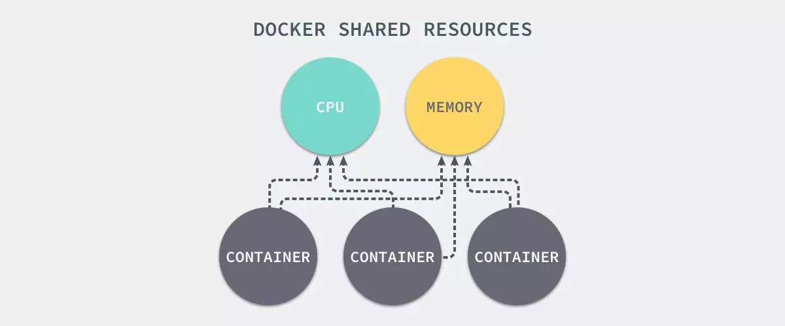

Control Groups（简称 CGroups）

> cgroups是Linux内核提供的一种机制，这种机制可以根据需求吧一系列系统任务及其子任务整合(或分隔)到按资源划分等级的不同组中，从而为系统资源管理提供一个统一的框架。

CGroups能够隔离宿主机器上的物理资源，例如 CPU、内存、磁盘 I/O 。每一个 CGroup 都是一组被相同的标准和参数限制的进程。而我们需要做的，其实就是把容器这个进程加入到指定的Cgroup中。

验证cgroup的内存限制：

- 准备一个程序，每秒钟申请1MB的内存, `mem-allocate.c`

  ```c
  #include <stdio.h>
  #include <stdlib.h>
  #include <string.h>
  #include <unistd.h>
  
  #define MB (1024 * 1024)
  
  int main(int argc, char *argv[])
  {
      char *p;
      int i = 0;
      while(1) {
          p = (char *)malloc(MB);
          memset(p, 0, MB);
          printf("%dM memory allocated\n", ++i);
          sleep(1);
      }
  
      return 0;
  }
  ```

- 创建cgroup文件及脚本

  ```bash
  cd /sys/fs/cgroup/memory/
  mkdir -p luffy && cd luffy
  echo 30M > memory.limit_in_bytes 
  gcc mem-allocate.c -o mem-allocate
  ```

- 准备脚本`cgroup-test.sh`

  ```bash
  sleep 30
  ./mem-allocate
  ```

- 用cgroup限制进程

  ```bash
  # 启动程序
  ./cgroup-test.sh
  
  # 查看程序进程
  ps aux|grep cgroup-test
  echo 16079 > /sys/fs/cgroup/memory/luffy/cgroup.procs
  ```

###### [UnionFS 联合文件系统](http://49.7.203.222:2023/#/docker/implementation?id=unionfs-联合文件系统)

Linux namespace和cgroup分别解决了容器的资源隔离与资源限制，那么容器是很轻量的，通常每台机器中可以运行几十上百个容器， 这些个容器是共用一个image，还是各自将这个image复制了一份，然后各自独立运行呢？ 如果每个容器之间都是全量的文件系统拷贝，那么会导致至少如下问题：

- 运行容器的速度会变慢
- 容器和镜像对宿主机的磁盘空间的压力

怎么解决这个问题------Docker的存储驱动

- 镜像分层存储 + 写时复制
- UnionFS

Docker 镜像是由一系列的层组成的，每层代表 Dockerfile 中的一条指令，比如下面的 Dockerfile 文件：

```dockerfile
FROM ubuntu:15.04
COPY . /app
RUN make /app
CMD python /app/app.py
```

这里的 Dockerfile 包含4条命令，其中每一行就创建了一层，下面显示了上述Dockerfile构建出来的镜像运行的容器层的结构：


镜像就是由这些层一层一层堆叠起来的，镜像中的这些层都是只读的，当我们运行容器的时候，就可以在这些基础层至上添加新的可写层，也就是我们通常说的`容器层`，对于运行中的容器所做的所有更改（比如写入新文件、修改现有文件、删除文件）都将写入这个容器层。

对容器层的操作，主要利用了写时复制（CoW）技术。CoW就是copy-on-write，表示只在需要写时才去复制，这个是针对已有文件的修改场景。 CoW技术可以让所有的容器共享image的文件系统，所有数据都从image中读取，只有当要对文件进行写操作时，才从image里把要写的文件复制到自己的文件系统进行修改。所以无论有多少个容器共享同一个image，所做的写操作都是对从image中复制到自己的文件系统中的复本上进行，并不会修改image的源文件，且多个容器操作同一个文件，会在每个容器的文件系统里生成一个复本，每个容器修改的都是自己的复本，相互隔离，相互不影响。使用CoW可以有效的提高磁盘的利用率。


**镜像中每一层的文件都是分散在不同的目录中的，如何把这些不同目录的文件整合到一起呢？**

UnionFS 其实是一种为 Linux 操作系统设计的用于把多个文件系统联合到同一个挂载点的文件系统服务。 它能够将不同文件夹中的层联合（Union）到了同一个文件夹中，整个联合的过程被称为联合挂载（Union Mount）。

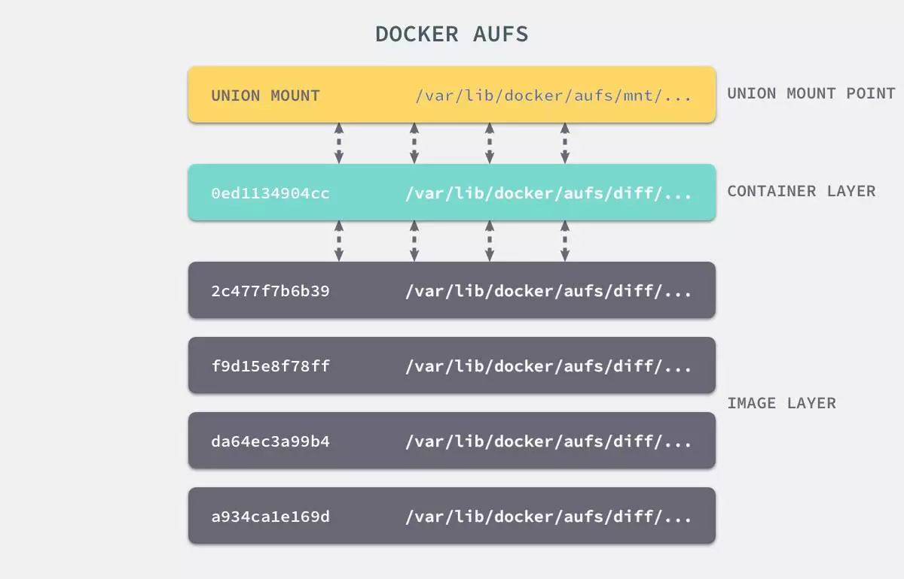

上图是AUFS的实现，AUFS是作为Docker存储驱动的一种实现，Docker 还支持了不同的存储驱动，包括 aufs、devicemapper、overlay2、zfs 和 Btrfs 等等，在最新的 Docker 中，overlay2 取代了 aufs 成为了推荐的存储驱动，但是在没有 overlay2 驱动的机器上仍然会使用 aufs 作为 Docker 的默认驱动。


#### [Docker网络](http://49.7.203.222:2023/#/docker/network?id=docker网络)

docker容器是一块具有隔离性的虚拟系统，容器内可以有自己独立的网络空间，

- 多个容器之间是如何实现通信的呢？
- 容器和宿主机之间又是如何实现的通信呢？
- 使用-p参数是怎么实现的端口映射?

带着这些问题，我们来学习一下docker的网络模型，最后我会通过抓包的方式，给大家演示一下数据包在容器和宿主机之间的转换过程。

##### [网络模式](http://49.7.203.222:2023/#/docker/network?id=网络模式)

我们在使用docker run创建Docker容器时，可以用--net选项指定容器的网络模式，Docker有以下4种网络模式：

- bridge模式，使用--net=bridge指定，默认设置

- host模式，使用--net=host指定，容器内部网络空间共享宿主机的空间，效果类似直接在宿主机上启动一个进程，端口信息和宿主机共用

- container模式，使用--net=container:NAME_or_ID指定

  指定容器与特定容器共享网络命名空间

- none模式，使用--net=none指定

  网络模式为空，即仅保留网络命名空间，但是不做任何网络相关的配置(网卡、IP、路由等)

##### [bridge模式](http://49.7.203.222:2023/#/docker/network?id=bridge模式)

那我们之前在演示创建docker容器的时候其实是没有指定的网络模式的，如果不指定的话默认就会使用bridge模式，bridge本意是桥的意思，其实就是网桥模式。

那我们怎么理解网桥，如果需要做类比的话，我们可以把网桥看成一个二层的交换机设备，我们来看下这张图：

交换机通信简图


交换机网络通信流程：

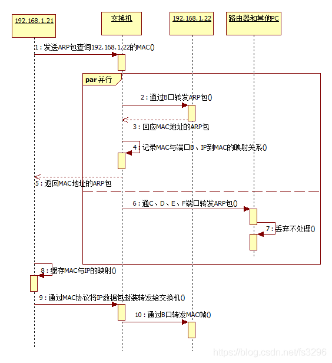

网桥模式示意图


Linux 中，能够起到**虚拟交换机作用**的网络设备，是网桥（Bridge）。它是一个工作在**数据链路层**（Data Link）的设备，主要功能是**根据 MAC 地址将数据包转发到网桥的不同端口上**。 网桥在哪，查看网桥

```bash
$ yum install -y bridge-utils
$ brctl show
bridge name     bridge id               STP enabled     interfaces
docker0         8000.0242b5fbe57b       no              veth3a496ed
```

有了网桥之后，那我们看下docker在启动一个容器的时候做了哪些事情才能实现容器间的互联互通

Docker 创建一个容器的时候，会执行如下操作：

- 创建一对虚拟接口/网卡，也就是veth pair；
- veth pair的一端桥接 到默认的 docker0 或指定网桥上，并具有一个唯一的名字，如 vethxxxxxx；
- veth paid的另一端放到新启动的容器内部，并修改名字作为 eth0，这个网卡/接口只在容器的命名空间可见；
- 从网桥可用地址段中（也就是与该bridge对应的network）获取一个空闲地址分配给容器的 eth0
- 配置容器的默认路由

那整个过程其实是docker自动帮我们完成的，清理掉所有容器，来验证。

```bash
## 清掉所有容器
$ docker rm -f `docker ps -aq`
$ docker ps
$ brctl show # 查看网桥中的接口，目前没有

## 创建测试容器test1
$ docker run -d --name test1 nginx:alpine
$ brctl show # 查看网桥中的接口，已经把test1的veth端接入到网桥中
$ ip a |grep veth # 已在宿主机中可以查看到
$ docker exec -ti test1 sh 
/ # ifconfig  # 查看容器的eth0网卡及分配的容器ip

# 再来启动一个测试容器，测试容器间的通信
$ docker run -d --name test2 nginx:alpine
$ docker exec -ti test2 sh
/ # sed -i 's/dl-cdn.alpinelinux.org/mirrors.tuna.tsinghua.edu.cn/g' /etc/apk/repositories
/ # apk add curl
/ # curl 172.17.0.8:80

## 为啥可以通信？
/ # route -n  # 
Kernel IP routing table
Destination     Gateway         Genmask         Flags Metric Ref    Use Iface
0.0.0.0         172.17.0.1      0.0.0.0         UG    0      0        0 eth0
172.17.0.0      0.0.0.0         255.255.0.0     U     0      0        0 eth0

# eth0 网卡是这个容器里的默认路由设备；所有对 172.17.0.0/16 网段的请求，也会被交给 eth0 来处理（第二条 172.17.0.0 路由规则），这条路由规则的网关（Gateway）是 0.0.0.0，这就意味着这是一条直连规则，即：凡是匹配到这条规则的 IP 包，应该经过本机的 eth0 网卡，通过二层网络(数据链路层)直接发往目的主机。

# 而要通过二层网络到达 test1 容器，就需要有 172.17.0.8 这个 IP 地址对应的 MAC 地址。所以test2容器的网络协议栈，就需要通过 eth0 网卡发送一个 ARP 广播，来通过 IP 地址查找对应的 MAC 地址。

#这个 eth0 网卡，是一个 Veth Pair，它的一端在这个 test2 容器的 Network Namespace 里，而另一端则位于宿主机上（Host Namespace），并且被“插”在了宿主机的 docker0 网桥上。网桥设备的一个特点是插在桥上的网卡都会被当成桥上的一个端口来处理，而端口的唯一作用就是接收流入的数据包，然后把这些数据包的“生杀大权”（比如转发或者丢弃），全部交给对应的网桥设备处理。

# 因此ARP的广播请求也会由docker0来负责转发，这样网桥就维护了一份端口与mac的信息表，因此针对test2的eth0拿到mac地址后发出的各类请求，同样走到docker0网桥中由网桥负责转发到对应的容器中。

# 网桥会维护一份mac映射表，我们可以大概通过命令来看一下，
$ brctl showmacs docker0
## 这些mac地址是主机端的veth网卡对应的mac，可以查看一下
$ ip a 
```


我们如何知道网桥上的这些虚拟网卡与容器端是如何对应？

通过ifindex，网卡索引号

```bash
## 查看test1容器的网卡索引
$ docker exec -ti test1 cat /sys/class/net/eth0/ifindex

## 主机中找到虚拟网卡后面这个@ifxx的值，如果是同一个值，说明这个虚拟网卡和这个容器的eth0网卡是配对的。
$ ip a |grep @if
```

整理脚本，快速查看对应：

```bash
for container in $(docker ps -q); do
    iflink=`docker exec -it $container sh -c 'cat /sys/class/net/eth0/iflink'`
    iflink=`echo $iflink|tr -d '\r'`
    veth=`grep -l $iflink /sys/class/net/veth*/ifindex`
    veth=`echo $veth|sed -e 's;^.*net/\(.*\)/ifindex$;\1;'`
    echo $container:$veth
done
```

上面我们讲解了容器之间的通信，那么容器与宿主机的通信是如何做的？

添加端口映射：

```bash
## 启动容器的时候通过-p参数添加宿主机端口与容器内部服务端口的映射
$ docker run --name test -d -p 8088:80 nginx:alpine
$ curl localhost:8088
```


端口映射如何实现的？先来回顾iptables链表图

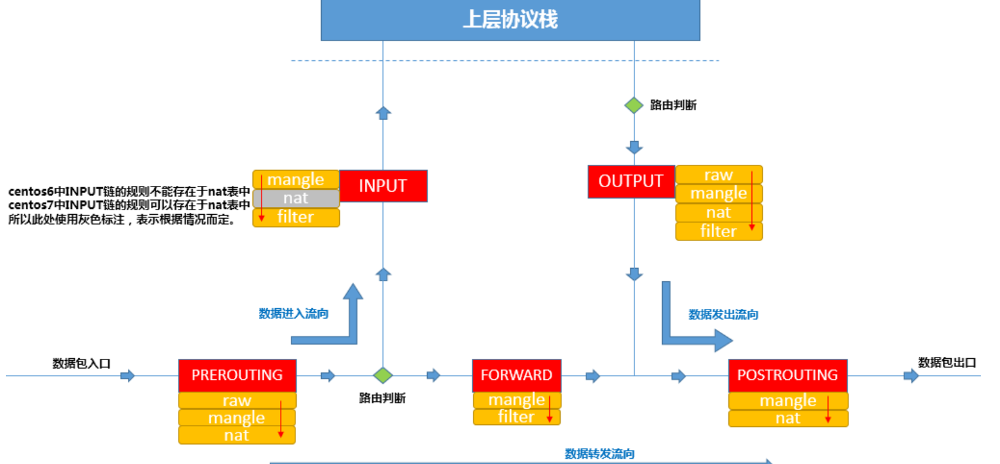

> [https://www.zsythink.net/archives/category/%e8%bf%90%e7%bb%b4%e7%9b%b8%e5%85%b3/iptables](https://www.zsythink.net/archives/category/运维相关/iptables)

访问本机的8088端口，数据包会从流入方向进入本机，因此涉及到PREROUTING和INPUT链，我们是通过做宿主机与容器之间加的端口映射，所以肯定会涉及到端口转换，那哪个表是负责存储端口转换信息的呢，就是nat表，负责维护网络地址转换信息的。因此我们来查看一下PREROUTING链的nat表：

```bash
$ iptables -t nat -nvL PREROUTING
Chain PREROUTING (policy ACCEPT 159 packets, 20790 bytes)
 pkts bytes target     prot opt in     out     source               destination
    3   156 DOCKER     all  --  *      *       0.0.0.0/0            0.0.0.0/0            ADDRTYPE match dst-type LOCAL
```

规则利用了iptables的addrtype拓展，匹配网络类型为本地的包，如何确定哪些是匹配本地，

```bash
$ ip route show table local type local
127.0.0.0/8 dev lo proto kernel scope host src 127.0.0.1
127.0.0.1 dev lo proto kernel scope host src 127.0.0.1
172.17.0.1 dev docker0 proto kernel scope host src 172.17.0.1
172.21.51.143 dev eth0 proto kernel scope host src 172.21.51.143
```

也就是说目标地址类型匹配到这些的，会转发到我们的TARGET中，TARGET是动作，意味着对符合要求的数据包执行什么样的操作，最常见的为ACCEPT或者DROP，此处的TARGET为DOCKER，很明显DOCKER不是标准的动作，那DOCKER是什么呢？我们通常会定义自定义的链，这样把某类对应的规则放在自定义链中，然后把自定义的链绑定到标准的链路中，因此此处DOCKER 是自定义的链。那我们现在就来看一下DOCKER这个自定义链上的规则。

```bash
$ iptables -t nat -nvL DOCKER
Chain DOCKER (2 references)                                                                                                
 pkts bytes target     prot opt in     out     source               destination                                            
    0     0 RETURN     all  --  docker0 *       0.0.0.0/0            0.0.0.0/0                                             
    0     0 DNAT       tcp  --  !docker0 *       0.0.0.0/0            0.0.0.0/0            tcp dpt:8088 to:172.17.0.2:80 
```

此条规则就是对主机收到的目的端口为8088的tcp流量进行DNAT转换，将流量发往172.17.0.2:80，172.17.0.2地址是不是就是我们上面创建的Docker容器的ip地址，流量走到网桥上了，后面就走网桥的转发就ok了。 所以，外界只需访问172.21.51.143:8088就可以访问到容器中的服务了。

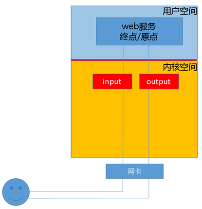

数据包在出口方向走POSTROUTING链，我们查看一下规则：

```bash
$ iptables -t nat -nvL POSTROUTING
Chain POSTROUTING (policy ACCEPT 1099 packets, 67268 bytes)
 pkts bytes target     prot opt in     out     source               destination
   86  5438 MASQUERADE  all  --  *      !docker0  172.17.0.0/16        0.0.0.0/0
    0     0 MASQUERADE  tcp  --  *      *       172.17.0.4           172.17.0.4           tcp dpt:80
```

大家注意MASQUERADE这个动作是什么意思，其实是一种更灵活的SNAT，把源地址转换成主机的出口ip地址，那解释一下这条规则的意思:

这条规则会将源地址为172.17.0.0/16的包（也就是从Docker容器产生的包），并且不是从docker0网卡发出的，进行源地址转换，转换成主机网卡的地址。大概的过程就是ACK的包在容器里面发出来，会路由到网桥docker0，网桥根据宿主机的路由规则会转给宿主机网卡eth0，这时候包就从docker0网卡转到eth0网卡了，并从eth0网卡发出去，这时候这条规则就会生效了，把源地址换成了eth0的ip地址。

> 注意一下，刚才这个过程涉及到了网卡间包的传递，那一定要打开主机的ip_forward转发服务，要不然包转不了，服务肯定访问不到。

###### [抓包演示](http://49.7.203.222:2023/#/docker/network?id=抓包演示)

我们先想一下，我们要抓哪个网卡的包

- 首先访问宿主机的8088端口，我们抓一下宿主机的eth0

  ```bash
  $ tcpdump -i eth0 port 8088 -w host.cap
  ```

- 然后最终包会流入容器内，那我们抓一下容器内的eth0网卡

  ```bash
  # 容器内安装一下tcpdump
  $ sed -i 's/dl-cdn.alpinelinux.org/mirrors.tuna.tsinghua.edu.cn/g' /etc/apk/repositories
  $ apk add tcpdump
  $ tcpdump -i eth0 port 80 -w container.cap
  ```

到另一台机器访问一下，

```bash
$ curl 172.21.51.143:8088/
```

停止抓包，拷贝容器内的包到宿主机

```bash
$ docker cp test:/root/container.cap /root/
```

把抓到的内容拷贝到本地，使用wireshark进行分析。

```bash
$ scp root@172.21.51.143:/root/*.cap /d/packages
```

（wireshark合并包进行分析）


进到容器内的包做DNAT，出去的包做SNAT，这样对外面来讲，根本就不知道机器内部是谁提供服务，其实这就和一个内网多个机器公用一个外网IP地址上网的效果是一样的，那这也属于NAT功能的一个常见的应用场景。

##### [Host模式](http://49.7.203.222:2023/#/docker/network?id=host模式)

容器内部不会创建网络空间，共享宿主机的网络空间。比如直接通过host模式创建mysql容器：

```bash
$ docker run --net host -d --name mysql -e MYSQL_ROOT_PASSWORD=123456 mysql:5.7
```

容器启动后，会默认监听3306端口，由于网络模式是host，因为可以直接通过宿主机的3306端口进行访问服务，效果等同于在宿主机中直接启动mysqld的进程。

##### [Conatiner模式](http://49.7.203.222:2023/#/docker/network?id=conatiner模式)

这个模式指定新创建的容器和已经存在的一个容器共享一个 Network Namespace，而不是和宿主机共享。新创建的容器不会创建自己的网卡，配置自己的 IP，而是和一个指定的容器共享 IP、端口范围等。同样，两个容器除了网络方面，其他的如文件系统、进程列表等还是隔离的。两个容器的进程可以通过 lo 网卡设备通信。


```bash
## 启动测试容器，共享mysql的网络空间
$ docker run -ti --rm --net=container:mysql busybox sh
/ # ip a
/ # netstat -tlp|grep 3306
/ # telnet localhost 3306
```

在一些特殊的场景中非常有用，例如，kubernetes的pod，kubernetes为pod创建一个基础设施容器，同一pod下的其他容器都以container模式共享这个基础设施容器的网络命名空间，相互之间以localhost访问，构成一个统一的整体。

##### [None模式](http://49.7.203.222:2023/#/docker/network?id=none模式)

只会创建对应的网络空间，不会配置网络堆栈（网卡、路由等）。

```bash
# 创建none的容器
$ docker run -it  --name=network-none --net=none nginx:alpine sh
# ifconfig
```

在宿主机中操作：

```bash
# 创建虚拟网卡对
$ ip link add A type veth peer name B
# A端插入到docker0网桥
$ brctl addif docker0 A
$ ip link set A up

# B端插入到network-none容器中，需要借助ip netns,因此需要显示的创建命名network namespace
$ PID=$(docker inspect -f '{{.State.Pid}}' network-none)
$ mkdir -p /var/run/netns
$ ln -s /proc/$PID/ns/net /var/run/netns/$PID

# B端放到容器的命名空间
$ ip link set B netns $PID
$ ip netns exec $PID ip link set dev B name eth0  # 修改设备名称为eth0，和docker默认行为一致
$ ip netns exec $PID ip link set eth0 up

# 设置ip
$ ip netns exec $PID ip addr add 172.17.0.100/16 dev eth0
# 添加默认路由，指定给docker0网桥
$ ip netns exec $PID ip route add default via 172.17.0.1

# 测试容器间通信
```

前置知识：

- ip netns 命令用来管理 network namespace。它可以创建命名的 network namespace，然后通过名字来引用 network namespace
- network namespace 在逻辑上是网络堆栈的一个副本，它有自己的路由、防火墙规则和网络设备。 默认情况下，子进程继承其父进程的 network namespace。也就是说，如果不显式创建新的 network namespace，所有进程都从 init 进程继承相同的默认 network namespace。
- 根据约定，命名的 network namespace 是可以打开的 **/var/run/netns/** 目录下的一个对象。比如有一个名称为 net1 的 network namespace 对象，则可以由打开 /var/run/netns/net1 对象产生的文件描述符引用 network namespace net1。通过引用该文件描述符，可以修改进程的 network namespace。


#### [containerd](http://49.7.203.222:2023/#/docker/containerd?id=containerd)

容器运行时（ContainerRuntime），运行于 kubernetes（k8s）集群的每个节点中，负责容器的整个生命周期。其中 docker 是目前应用最广的。随着容器云的发展，越来越多的容器运行时涌现。为了解决这些容器运行时和 k8s 的集成问题，在 k8s1.5 版本中，社区推出了 CRI（ContainerRuntimeInterface,容器运行时接口）（如图 1 所示），以支持更多的容器运行时。

Kubelet 通过 CRI 和容器运行时进行通信，使得容器运行时能够像插件一样单独运行。可以说每个容器运行时都有自己的优势，这就允许用户更容易选择和替换自己的容器运行时。

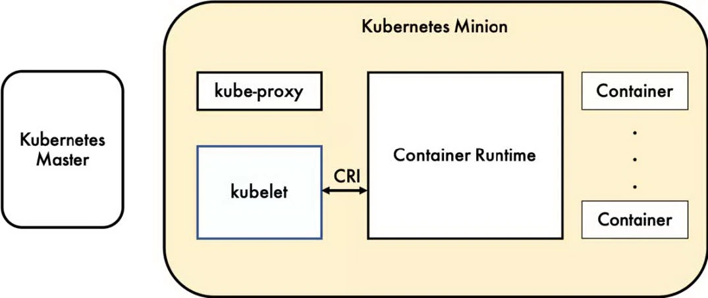

##### [CRI & OCI](http://49.7.203.222:2023/#/docker/containerd?id=cri-amp-oci)


OCI（OpenContainerInitiative，开放容器计划）定义了创建容器的格式和运行时的开源行业标准，包括镜像规范（ImageSpecification）和运行时规范(RuntimeSpecification)。

镜像规范定义了 OCI 镜像的标准。如图 2 所示，高层级运行时将会下载一个 OCI 镜像，并把它解压成 OCI 运行时文件系统包（filesystembundle）。

运行时规范则描述了如何从 OCI 运行时文件系统包运行容器程序，并且定义它的配置、运行环境和生命周期。如何为新容器设置命名空间(namepsaces)和控制组(cgroups)，以及挂载根文件系统等等操作，都是在这里定义的。它的一个参考实现是 runC。我们称其为低层级运行时（Low-levelRuntime）。除 runC 以外，也有很多其他的运行时遵循 OCI 标准，例如 kata-runtime。

##### [为什么弃用Docker](http://49.7.203.222:2023/#/docker/containerd?id=为什么弃用docker)

目前 docker 仍是 kubernetes 默认的容器运行时。那为什么会选择换掉 docker 呢？主要的原因是它的复杂性。

如图 3 所示，我们总结了 docker,containerd 以及 cri-o 的详细调用层级。Docker 的多层封装和调用，导致其在可维护性上略逊一筹，增加了线上问题的定位难度（貌似除了重启 docker，我们就毫无他法了）。Containerd 和 cri-o 的方案比起 docker 简洁很多。因此我们更偏向于选用更加简单和纯粹的 containerd 和 cri-o 作为我们的容器运行时。 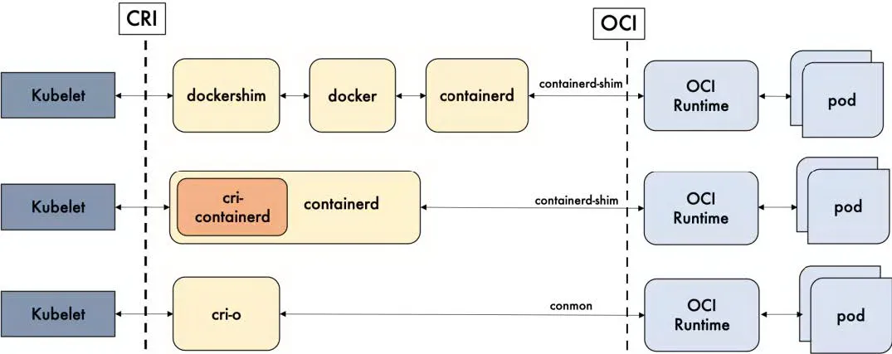

我们对 containerd 和 cri-o 进行了一组性能测试，包括创建、启动、停止和删除容器，以比较它们所耗的时间。如图 4 所示，containerd 在各个方面都表现良好，除了启动容器这项。从总用时来看，containerd 的用时还是要比 cri-o 要短的。

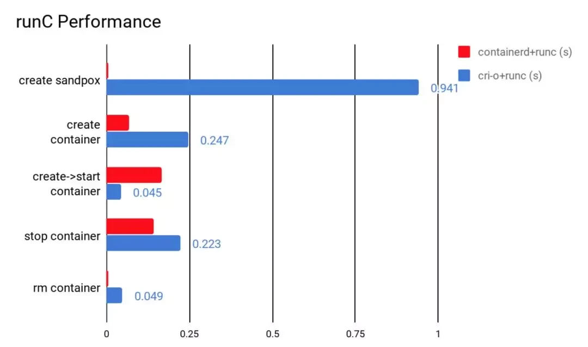

从功能性来讲，containerd 和 cri-o 都符合 CRI 和 OCI 的标准。从稳定性来说，单独使用 containerd 和 cri-o 都没有足够的生产环境经验。但庆幸的是，containerd 一直在 docker 里使用，而 docker 的生产环境经验可以说比较充足。可见在稳定性上 containerd 略胜一筹。所以我们最终选用了 containerd

#### [containerd操作](http://49.7.203.222:2023/#/docker/containerd?id=containerd操作)

https://blog.csdn.net/Michaelwubo/article/details/122745348 https://www.cnblogs.com/liugp/p/16633732.html


#### [实用技巧](http://49.7.203.222:2023/#/docker/summary?id=实用技巧)

1. 清理主机上所有退出的容器

   ```bash
   $ docker rm  $(docker ps -aq)
   ```

2. 调试或者排查容器启动错误

   ```bash
   ## 若有时遇到容器启动失败的情况，可以先使用相同的镜像启动一个临时容器，先进入容器
   $ docker run --rm -ti <image_id> sh
   ## 进入容器后，手动执行该容器对应的ENTRYPOINT或者CMD命令，这样即使出错，容器也不会退出，因为bash作为1号进程，我们只要不退出容器，该容器就不会自动退出
   ```

#### [本章小结](http://49.7.203.222:2023/#/docker/summary?id=本章小结)


1. 为了解决软件交付过程中的环境依赖，同时提供一种更加轻量的虚拟化技术，Docker出现了。
2. 2013年诞生，15年开始迅速发展，从17.03月开始，使用时间日期管理版本，稳定版以每季度为准。
3. Docker是一种CS架构的软件产品，可以把代码及依赖打包成镜像，作为交付介质，并且把镜像启动成为容器，提供容器生命周期的管理。
4. 使用yum部署docker，启动后通过操作docker这个命令行，自动调用docker daemon完成容器相关操作。
5. 常用操作，围绕`镜像|容器|仓库`三大核心要素
   - systemctl start|stop|restart docker
   - docker build | pull -> docker tag -> docker push
   - docker run --name my-demo -d -p 8080:80 -v /opt/data:/data demo:v20200327 ping xx.com
   - docker cp /path/a.txt mycontainer:/opt
   - docker exec -ti mycontainer /bin/sh
   - docker logs -f --tail=100 mycontainer
6. 通过dockerfile构建业务镜像，先使用基础镜像，然后通过一系列的指令把我们的业务应用所需要的运行环境和依赖都打包到镜像中，然后通过CMD或者ENTRYPOINT指令把镜像启动时的入口制定好，完成封装即可。有点类似于，先找来一个集装箱模板(基础镜像)，然后把项目依赖的服务都扔到集装箱中，然后设置好服务的启动入口，关闭箱门，即完成了业务镜像的制作。
7. 容器的实现依赖于内核模块提供的namespace和control-group的功能，通过namespace创建一块虚拟空间，空间内实现了各类资源(进程、网络、文件系统)的隔离，提供control-group实现了对隔离的空间的资源使用的限制。
8. docker镜像使用分层的方式进行存储，根据主机的存储驱动的不同，实现方式会不同，kernel在3.10.0-514以上自动支持overlay2 存储驱动，也是目前Docker推荐的方式。
9. 得益于分层存储的模式，多个容器可以通过copy-on-write的策略，在镜像的最上层加一个可写层，同时利用存储驱动的UnionFS的能力，实现一个镜像快速启动多个容器的场景。
10. docker的网络模式分为4种，最常用的为bridge和host模式。bridge模式通过docker0网桥，启动容器的时候通过创建一对虚拟网卡，将容器连接在桥上，同时维护了虚拟网卡与网桥端口的关系，实现容器间的通信。容器与宿主机之间的通信通过iptables端口映射的方式，docker利用iptables的PREROUTING和POSTROUTING的nat功能，实现了SNAT与DNAT，使得容器内部的服务被完美的保护起来。
11. 本章重点内容是docker的核心要素及基础的操作，实现原理以及docker的网络模式为选修包，目的为了帮助有docker基础及经验的同学更好的进一步理解docker。