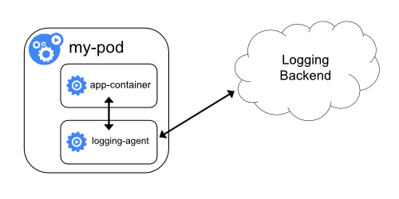
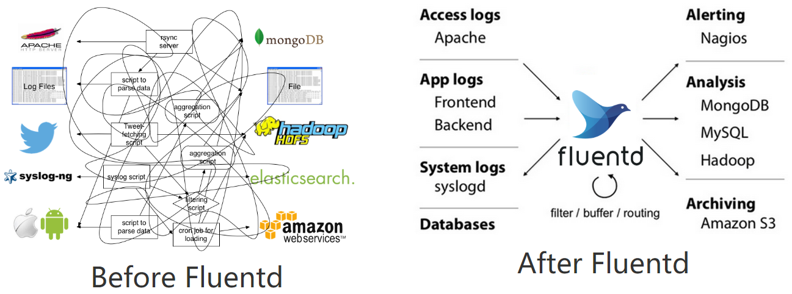
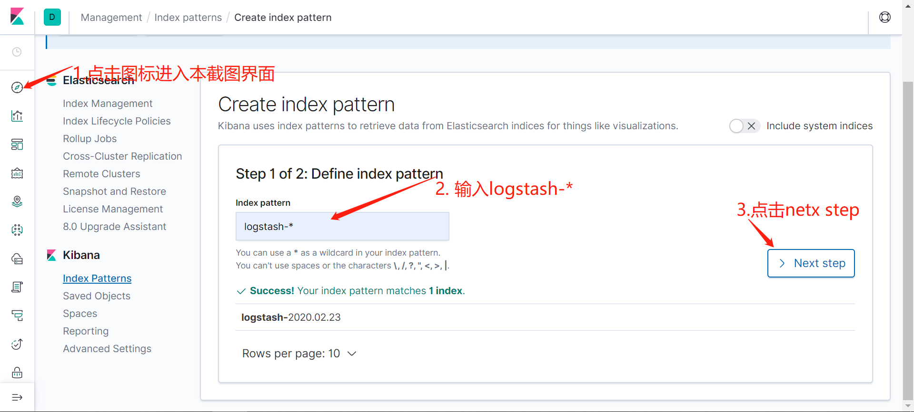
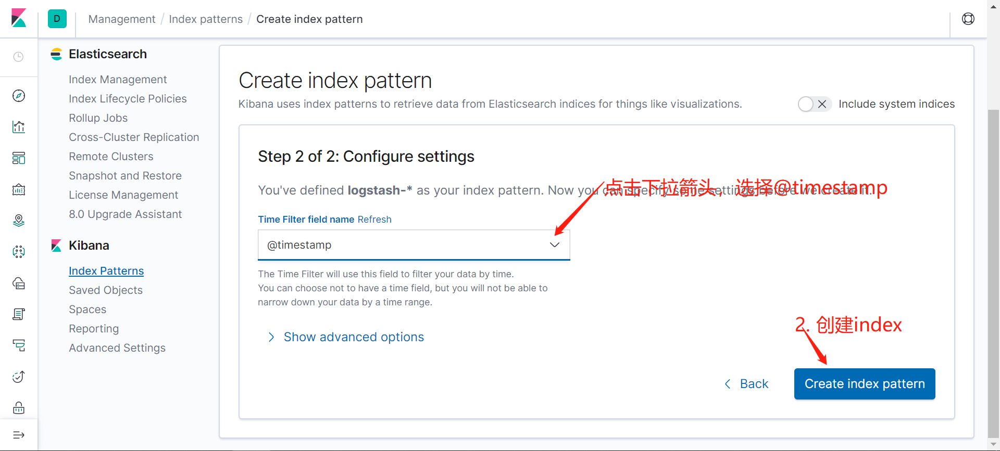
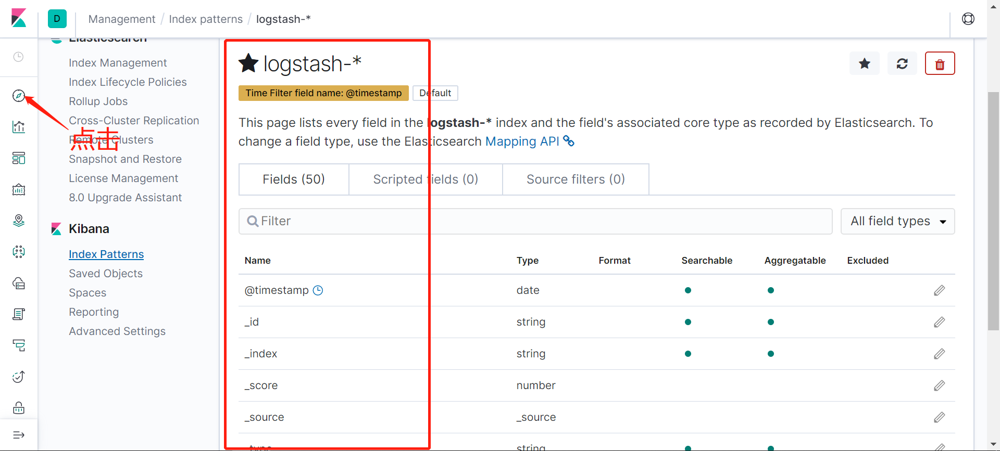
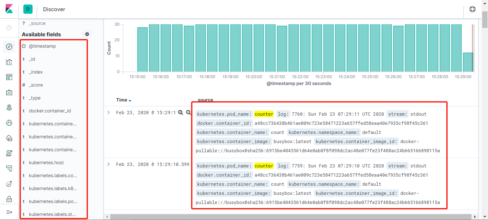

# 日志采集架构

#### [k8s日志收集架构](http://49.7.203.222:2023/#/logging/arct?id=k8s日志收集架构)

https://kubernetes.io/docs/concepts/cluster-administration/logging/

##### [容器日志的存储](http://49.7.203.222:2023/#/logging/arct?id=容器日志的存储)

- Docker容器的日志

  容器日志驱动：

  https://docs.docker.com/config/containers/logging/configure/

  查看当前的docker主机的驱动：

  ```bash
  $ docker info --format '{{.LoggingDriver}}'
  ```

  json-file格式，docker会默认将标准和错误输出保存为宿主机的文件，路径为：

  `/var/lib/docker/containers/<container-id>/<container-id>-json.log`

  并且可以设置日志轮转：

  ```json
  {
    "log-driver": "json-file",
    "log-opts": {
      "max-size": "10m",
      "max-file": "3",
      "labels": "production_status",
      "env": "os,customer"
    }
  }
  ```

- k8s Pod的日志存储

  ```bash
  $ ll /var/log/pods/
  ```

总体分为三种方式：

- 使用在每个节点上运行的节点级日志记录代理。
- 在应用程序的 pod 中，包含专门记录日志的 sidecar 容器。
- 将日志直接从应用程序中推送到日志记录后端。

##### [使用节点级日志代理]


优势：

- 部署方便，使用DaemonSet类型控制器来部署agent即可
- 对业务应用的影响最小，没有侵入性

劣势:

- 只能收集标准和错误输出，对于容器内的文件日志，暂时收集不到

##### [使用 sidecar 容器和日志代理](http://49.7.203.222:2023/#/logging/arct?id=使用-sidecar-容器和日志代理)

- ###### [方式一：sidecar 容器将应用程序日志传送到自己的标准输出。](http://49.7.203.222:2023/#/logging/arct?id=方式一：sidecar-容器将应用程序日志传送到自己的标准输出。)

  思路：在pod中启动一个sidecar容器，把容器内的日志文件吐到标准输出，由宿主机中的日志收集agent进行采集。

  

  ```bash
  cat <<\EOF count-pod.yaml
  apiVersion: v1
  kind: Pod
  metadata:
    name: counter
  spec:
    containers:
    - name: count
      image: busybox
      args:
      - /bin/sh
      - -c
      - >
        i=0;
        while true;
        do
          echo "$i: $(date)" >> /var/log/1.log;
          echo "$(date) INFO $i" >> /var/log/2.log;
          i=$((i+1));
          sleep 1;
        done
      volumeMounts:
      - name: varlog
        mountPath: /var/log
    - name: count-log-1
      image: busybox
      args: [/bin/sh, -c, 'tail -n+1 -f /var/log/1.log']
      volumeMounts:
      - name: varlog
        mountPath: /var/log
    - name: count-log-2
      image: busybox
      args: [/bin/sh, -c, 'tail -n+1 -f /var/log/2.log']
      volumeMounts:
      - name: varlog
        mountPath: /var/log
    volumes:
    - name: varlog
      emptyDir: {}
  EOF
  
  kubectl apply -f counter-pod.yaml
  kubectl logs -f counter -c count-log-1
  ```

  优势：

  - 可以实现容器内部日志收集
  - 对业务应用的侵入性不大

  劣势：

  - 每个业务pod都需要做一次改造
  - 增加了一次日志的写入，对磁盘使用率有一定影响

- ###### [方式二：sidecar 容器运行一个日志代理，配置该日志代理以便从应用容器收集日志。](http://49.7.203.222:2023/#/logging/arct?id=方式二：sidecar-容器运行一个日志代理，配置该日志代理以便从应用容器收集日志。)

  

  思路：直接在业务Pod中使用sidecar的方式启动一个日志收集的组件（比如fluentd），这样日志收集可以将容器内的日志当成本地文件来进行收取。

  优势：不用往宿主机存储日志，本地日志完全可以收集

  劣势：每个业务应用额外启动一个日志agent，带来额外的资源损耗

##### [从应用中直接暴露日志目录](http://49.7.203.222:2023/#/logging/arct?id=从应用中直接暴露日志目录)


##### [企业日志方案选型](http://49.7.203.222:2023/#/logging/arct?id=企业日志方案选型)

目前来讲，最建议的是采用节点级的日志代理。

方案一：自研方案，实现一个自研的日志收集agent，大致思路：

- 针对容器的标准输出及错误输出，使用常规的方式，监听宿主机中的容器输出路径即可
- 针对容器内部的日志文件
  - 在容器内配置统一的环境变量，比如LOG_COLLECT_FILES，指定好容器内待收集的日志目录及文件
  - agent启动的时候挂载docker.sock文件及磁盘的根路径
  - 监听docker的容器新建、删除事件，通过docker的api，查出容器的存储、环境变量、k8s属性等信息
  - 配置了LOG_COLLECT_FILES环境变量的容器，根据env中的日志路径找到主机中对应的文件路径，然后生成收集的配置文件
  - agent与开源日志收集工具（Fluentd或者filebeat等）配合，agent负责下发配置到收集工具中并对进程做reload

> fluentd-pilot

方案二：日志使用开源的Agent进行收集（EFK方案），适用范围广，可以满足绝大多数日志收集、展示的需求。


# fluentd概念及工作流程

##### [EFK架构工作流程](http://49.7.203.222:2023/#/logging/fluentd-concept?id=efk架构工作流程)


- Elasticsearch

  一个开源的分布式、Restful 风格的搜索和数据分析引擎，它的底层是开源库Apache Lucene。它可以被下面这样准确地形容：

  - 一个分布式的实时文档存储，每个字段可以被索引与搜索；
  - 一个分布式实时分析搜索引擎；
  - 能胜任上百个服务节点的扩展，并支持 PB 级别的结构化或者非结构化数据。

- Kibana

  Kibana是一个开源的分析和可视化平台，设计用于和Elasticsearch一起工作。可以通过Kibana来搜索，查看，并和存储在Elasticsearch索引中的数据进行交互。也可以轻松地执行高级数据分析，并且以各种图标、表格和地图的形式可视化数据。

- [Fluentd](https://docs.fluentd.org/)

  一个针对日志的收集、处理、转发系统。通过丰富的插件系统，可以收集来自于各种系统或应用的日志，转化为用户指定的格式后，转发到用户所指定的日志存储系统之中。

  

  Fluentd 通过一组给定的数据源抓取日志数据，处理后（转换成结构化的数据格式）将它们转发给其他服务，比如 Elasticsearch、对象存储、kafka等等。Fluentd 支持超过300个日志存储和分析服务，所以在这方面是非常灵活的。主要运行步骤如下

  1. 首先 Fluentd 从多个日志源获取数据
  2. 结构化并且标记这些数据
  3. 然后根据匹配的标签将数据发送到多个目标服务

##### [Fluentd精讲](http://49.7.203.222:2023/#/logging/fluentd-concept?id=fluentd精讲)

###### [Fluentd架构](http://49.7.203.222:2023/#/logging/fluentd-concept?id=fluentd架构)



为什么推荐使用fluentd作为k8s体系的日志收集工具？

- 云原生：https://github.com/kubernetes/kubernetes/tree/release-1.21/cluster/addons/fluentd-elasticsearch

- 将日志文件JSON化

  

- 可插拔架构设计

  

- 极小的资源占用

  基于C和Ruby语言， 30-40MB，13,000 events/second/core

  

- 极强的可靠性

  - 基于内存和本地文件的缓存
  - 强大的故障转移

###### [fluentd事件流的生命周期及指令配置](http://49.7.203.222:2023/#/logging/fluentd-concept?id=fluentd事件流的生命周期及指令配置)

https://docs.fluentd.org/v/0.12/quickstart/life-of-a-fluentd-event

```bash
Input -> filter 1 -> ... -> filter N -> Buffer -> Output
```

启动命令

```bash
$ fluentd -c fluent.conf
```

指令介绍：

- [source](https://docs.fluentd.org/v/0.12/input) ，数据源，对应Input 通过使用 source 指令，来选择和配置所需的输入插件来启用 Fluentd 输入源， source 把事件提交到 fluentd 的路由引擎中。使用type来区分不同类型的数据源。如下配置可以监听指定文件的追加输入：

  ```bash
  <source>
    @type tail
    path /var/log/httpd-access.log
    pos_file /var/log/td-agent/httpd-access.log.pos
    tag myapp.access
    format apache2
  </source>
  ```

- filter，Event processing pipeline（事件处理流）

  filter 可以串联成 pipeline，对数据进行串行处理，最终再交给 match 输出。 如下可以对事件内容进行处理：

  ```bash
  <source>
    @type http
    port 9880
  </source>
  
  <filter myapp.access>
    @type record_transformer
    <record>
      host_param “#{Socket.gethostname}”
    </record>
  </filter>
  ```

  filter 获取数据后，调用内置的 @type record_transformer 插件，在事件的 record 里插入了新的字段 host_param，然后再交给 match 输出。

- label指令

  可以在 `source` 里指定 `@label`，这个 source 所触发的事件就会被发送给指定的 label 所包含的任务，而不会被后续的其他任务获取到。

  ```yaml
  <source>
    @type forward
  </source>
  
  <source>
  ### 这个任务指定了 label 为 @SYSTEM
  ### 会被发送给 <label @SYSTEM>
  ### 而不会被发送给下面紧跟的 filter 和 match
    @type tail
    @label @SYSTEM
    path /var/log/httpd-access.log
    pos_file /var/log/td-agent/httpd-access.log.pos
    tag myapp.access
    format apache2
  </source>
  
  <filter access.**>
    @type record_transformer
    <record>
    # …
    </record>
  </filter>
  
  <match **>
    @type elasticsearch
    # …
  </match>
  
  <label @SYSTEM>
    ### 将会接收到上面 @type tail 的 source event
    <filter var.log.middleware.**>
      @type grep
      # …
    </filter>
  
    <match **>
      @type s3
      # …
    </match>
  </label>
  ```

- match，匹配输出

  查找匹配 “tags” 的事件，并处理它们。match 命令的最常见用法是将事件输出到其他系统（因此，与 match 命令对应的插件称为 “输出插件”）

  ```bash
  <source>
    @type http
    port 9880
  </source>
  
  <filter myapp.access>
    @type record_transformer
    <record>
      host_param “#{Socket.gethostname}”
    </record>
  </filter>
  
  <match myapp.access>
    @type file
    path /var/log/fluent/access
  </match>
  ```

事件的结构：

time：事件的处理时间

tag：事件的来源，在fluentd.conf中配置

record：真实的日志内容，json对象

比如，下面这条原始日志：

```yaml
192.168.0.1 - - [28/Feb/2013:12:00:00 +0900] "GET / HTTP/1.1" 200 777
```

经过fluentd 引擎处理完后的样子可能是：

```bash
2020-07-16 08:40:35 +0000 apache.access: {"user":"-","method":"GET","code":200,"size":777,"host":"192.168.0.1","path":"/"}
```

###### [fluentd的buffer事件缓冲模型](http://49.7.203.222:2023/#/logging/fluentd-concept?id=fluentd的buffer事件缓冲模型)

```bash
Input -> filter 1 -> ... -> filter N -> Buffer -> Output
```


因为每个事件数据量通常很小，考虑数据传输效率、稳定性等方面的原因，所以基本不会每条事件处理完后都会立马写入到output端，因此fluentd建立了缓冲模型，模型中主要有两个概念：

- buffer_chunk：事件缓冲块，用来存储本地已经处理完待发送至目的端的事件，可以设置每个块的大小。
- buffer_queue：存储chunk的队列，可以设置长度

可以设置的参数，主要有：

- buffer_type，缓冲类型，可以设置file或者memory
- buffer_chunk_limit，每个chunk块的大小，默认8MB
- buffer_queue_limit ，chunk块队列的最大长度，默认256
- flush_interval ，flush一个chunk的时间间隔
- retry_limit ，chunk块发送失败重试次数，默认17次，之后就丢弃该chunk数据
- retry_wait ，重试发送chunk数据的时间间隔，默认1s，第2次失败再发送的话，间隔2s，下次4秒，以此类推

大致的过程为：

随着fluentd事件的不断生成并写入chunk，缓存块持变大，当缓存块满足buffer_chunk_limit大小或者新的缓存块诞生超过flush_interval时间间隔后，会推入缓存queue队列尾部，该队列大小由buffer_queue_limit决定。

比较理想的情况是每次有新的缓存块进入缓存队列，则立马会被写入到后端，同时，新缓存块也持续入列，但是入列的速度不会快于出列的速度，这样基本上缓存队列处于空的状态，队列中最多只有一个缓存块。

但是实际情况考虑网络等因素，往往缓存块被写入后端存储的时候会出现延迟或者写入失败的情况，当缓存块写入后端失败时，该缓存块还会留在队列中，等retry_wait时间后重试发送，当retry的次数达到retry_limit后，该缓存块被销毁（数据被丢弃）。

此时缓存队列持续有新的缓存块进来，如果队列中存在很多未及时写入到后端存储的缓存块的话，当队列长度达到buffer_queue_limit大小，则新的事件被拒绝，fluentd报错，`error_class=Fluent::Plugin::Buffer::BufferOverflowError error="buffer space has too many data"。`

还有一种情况是网络传输缓慢的情况，若每3秒钟会产生一个新块，但是写入到后端时间却达到了30s钟，队列长度为100，那么每个块出列的时间内，又有新的10个块进来，那么队列很快就会被占满，导致异常出现。


# fluentd配置实战


###### [实践一：监听业务应用日志，收集并输出](http://49.7.203.222:2023/#/logging/fluentd-practice?id=实践一：监听业务应用日志，收集并输出)

目标：收集容器内的nginx应用的access.log日志，并解析日志字段为JSON格式，原始日志的格式为：

```bash
$ tail -f access.log
...
53.49.146.149 1561620585.973 0.005 502 [27/Jun/2019:15:29:45 +0800] 178.73.215.171 33337 GET https
```

思路：

- 配置fluent.conf
  - 使用@tail插件通过监听access.log文件
  - 启动fluentd服务
- 手动追加内容至access.log文件
- 观察本地输出内容是否符合预期

*fluent.conf*

```bash
<source>
    @type tail
    path /var/log/nginx/access.log
    pos_file /var/log/nginx/nginx_access.posg
    tag nginx_access
    format none
    @log_level trace
</source>
<match  nginx_access>
    @type stdout
</match>
```

启动服务，追加文件内容：

```bash
# https://github.com/fluent/fluentd-kubernetes-daemonset
$ docker run -u root --rm -ti --entrypoint='' fluent/fluentd-kubernetes-daemonset:v1-debian-elasticsearch-amd64 bash

cat <<EOF >fluent.conf
<source>
    @type tail
    path /var/log/nginx/access.log
    pos_file /var/log/nginx/nginx_access.posg
    tag nginx_access
    format none
    @log_level trace
</source>
<match  nginx_access>
    @type stdout
</match>
EOF
/ # fluentd -c fluent.conf  # 终端监听/var/log/nginx/access.log 日志数据,有新数据会输出到标准输出

#另一个窗口操作 写入日志信息 
[root@k8s-master ~]# docker ps
CONTAINER ID   IMAGE      COMMAND      CREATE      STATUS      PORTS              NAMES
65405228cb17   fluent/fluentd-kubernetes-daemonset:v1-debian-elasticsearch-amd64   "bash"          
[root@k8s-master ~]# docker exec -ti 65405228cb17 sh
/ # echo '53.49.146.149 1561620585.973 0.005 502 [27/Jun/2019:15:29:45 +0800] 178.73.215.171 33337 GET https' >>/var/log/nginx/access.log


# 输出结果：
2022-11-19 03:31:42.956800427 +0000 nginx_access: {"message":"53.49.146.149 1561620585.973 0.005 502 [27/Jun/2019:15:29:45 +0800] 178.73.215.171 33337 GET https"}
```

###### [实践二：实现业务应用日志的收集及字段解析](http://49.7.203.222:2023/#/logging/fluentd-practice?id=实践二：实现业务应用日志的收集及字段解析)

目标：收集容器内的nginx应用的access.log日志，并解析日志字段为JSON格式，原始日志的格式为：

```bash
$ tail -f access.log
...
53.49.146.149 1561620585.973 0.005 502 [27/Jun/2019:15:29:45 +0800] 178.73.215.171 33337 GET https
```

收集并处理成：

```json
{
    "serverIp": "53.49.146.149",
    "timestamp": "1561620585.973",
    "respondTime": "0.005",
    "httpCode": "502",
    "eventTime": "27/Jun/2019:15:29:45 +0800",
    "clientIp": "178.73.215.171",
    "clientPort": "33337",
    "method": "GET",
    "protocol": "https"
}
```

*fluent.conf*

```bash

cat <<EOF >fluent.conf
<source>
    @type tail
    path /var/log/nginx/access.log
    pos_file /var/log/nginx/nginx_access.posg
    tag nginx_access
    format none
    @log_level trace
</source>
<filter  nginx_access>
    @type parser
    key_name message
    format  /(?<serverIp>[^ ]*) (?<timestamp>[^ ]*) (?<respondTime>[^ ]*) (?<httpCode>[^ ]*) \[(?<eventTime>[^\]]*)\] (?<clientIp>[^ ]*) (?<clientPort>[^ ]*) (?<method>[^ ]*) (?<protocol>[^ ]*)/
</filter>
<match  nginx_access>
  @type stdout
</match>
EOF

#修改配置后重新运行
root@65405228cb17:/home/fluent# fluentd -c fluent.conf

#另一个窗口,模拟产生日志
/ # echo '53.49.146.149 1561620585.973 0.005 502 [27/Jun/2019:15:29:45 +0800] 178.73.215.171 33337 GET https' >>/var/log/nginx/access.log
```

输出结果：

```bash
2022-11-19 03:34:43.005963334 +0000 nginx_access: {"serverIp":"53.49.146.149","timestamp":"1561620585.973","respondTime":"0.005","httpCode":"502","eventTime":"27/Jun/2019:15:29:45 +0800","clientIp":"178.73.215.171","clientPort":"33337","method":"GET","protocol":"https"}
```

使用该网站进行正则校验： [http://fluentular.herokuapp.com](http://fluentular.herokuapp.com/)

###### [实践三：使用ruby实现日志字段的转换及自定义处理](http://49.7.203.222:2023/#/logging/fluentd-practice?id=实践三：使用ruby实现日志字段的转换及自定义处理)

```bash
cat <<\EOF > fluent.conf
<source>
    @type tail
    path /var/log/nginx/access.log
    pos_file /var/log/nginx/nginx_access.posg
    tag nginx_access
    format none
    @log_level trace
</source>
<filter  nginx_access>
    @type parser
    key_name message
    format  /(?<serverIp>[^ ]*) (?<timestamp>[^ ]*) (?<respondTime>[^ ]*) (?<httpCode>[^ ]*) \[(?<eventTime>[^\]]*)\] (?<clientIp>[^ ]*) (?<clientPort>[^ ]*) (?<method>[^ ]*) (?<protocol>[^ ]*)/
</filter>
<filter  nginx_access>   
   @type record_transformer
   enable_ruby
   <record>
      host_name "#{Socket.gethostname}"
      my_key  "my_val"
      tls ${record["protocol"].index("https") ? "true" : "false"}
    </record>
</filter>
<match  nginx_access>
  @type stdout
</match>
EOF

#修改配置后重新运行
root@65405228cb17:/home/fluent# fluentd -c fluent.conf

#另一个窗口,模拟产生日志
/ # echo '53.49.146.149 1561620585.973 0.005 502 [27/Jun/2019:15:29:45 +0800] 178.73.215.171 33337 GET https' >>/var/log/nginx/access.log
```

输出结果：

```bash
2022-11-19 03:37:08.365890122 +0000 nginx_access: {"serverIp":"53.49.146.149","timestamp":"1561620585.973","respondTime":"0.005","httpCode":"502","eventTime":"27/Jun/2019:15:29:45 +0800","clientIp":"178.73.215.171","clientPort":"33337","method":"GET","protocol":"https","host_name":"23c22d63a1a7","my_key":"my_val","tls":"true"}
Input -> filter 1 -> ... -> filter N -> Buffer -> Output
```


# configMap挂载场景

##### [ConfigMap的配置文件挂载使用场景](http://49.7.203.222:2023/#/logging/using-configmap?id=configmap的配置文件挂载使用场景)

开始之前，我们先来回顾一下，configmap的常用的挂载场景。

###### [场景一：单文件挂载到空目录](http://49.7.203.222:2023/#/logging/using-configmap?id=场景一：单文件挂载到空目录)

假如业务应用有一个配置文件，名为 `application.yml`，如果想将此配置挂载到pod的`/etc/application/`目录中。

`application.yml`的内容为：

```bash
cat <<\EOF > application.yml 
spring:
  application:
    name: svca-service
  cloud:
    config:
      uri: http://config:8888
      fail-fast: true
      username: user
      password: ${CONFIG_SERVER_PASSWORD:password}
      retry:
        initial-interval: 2000
        max-interval: 10000
        multiplier: 2
        max-attempts: 10
EOF

```

该配置文件在k8s中可以通过configmap来管理，通常我们有如下两种方式来管理配置文件：

- 通过kubectl命令行来生成configmap

  ```bash
  # 通过文件直接创建
  kubectl -n default create configmap application-config --from-file=application.yml
  
  # 会生成配置文件，查看内容，configmap的key为文件名字
  kubectl -n default get cm application-config -oyaml
  ```

- 通过yaml文件直接创建

  ```bash
  cat <<\EOF > application-config.yaml
  apiVersion: v1
  kind: ConfigMap
  metadata:
    name: application-config
    namespace: default
  data:
    application.yml: |
      spring:
        application:
          name: svca-service
        cloud:
          config:
            uri: http://config:8888
            fail-fast: true
            username: user
            password: ${CONFIG_SERVER_PASSWORD:password}
            retry:
              initial-interval: 2000
              max-interval: 10000
              multiplier: 2
              max-attempts: 10
  EOF
  
  # 创建configmap
  $ kubectl apply -f application-config.yaml
  ```

准备一个`demo-deployment.yaml`文件，挂载上述configmap到`/etc/application/`中

```bash
cat <<\EOF > demo-deployment.yaml
apiVersion: apps/v1
kind: Deployment
metadata:
  name: demo
  namespace: default
spec:
  selector:
    matchLabels:
      app: demo
  template:
    metadata:
      labels:
        app: demo
    spec:
      volumes:
      - configMap:
          name: application-config
        name: config
      containers:
      - name: nginx
        image: nginx:alpine
        imagePullPolicy: IfNotPresent
        volumeMounts:
        - mountPath: "/etc/application"
          name: config
EOF

```

创建并查看：

```bash
$ kubectl apply -f demo-deployment.yaml

kubectl get po
kubectl exec demo-67c7c99d47-vvltn -- cat /etc/application/application.yml

```

修改configmap文件的内容，观察pod中是否自动感知变化：

```bash
$ kubectl edit cm application-config

[root@k8s-master helm3]# kubectl edit cm application-config  #修改了端口 8889
Edit cancelled, no changes made.
[root@k8s-master helm3]# kubectl exec demo-67c7c99d47-vvltn -- cat /etc/application/application.yml # 30秒之后查看也改变了
```

> 整个configmap文件直接挂载到pod中，若configmap变化，pod会自动感知并拉取到pod内部。
>
> 但是pod内的进程不会自动重启，所以很多服务会实现一个内部的reload接口，用来加载最新的配置文件到进程中。

###### [场景二：多文件挂载](http://49.7.203.222:2023/#/logging/using-configmap?id=场景二：多文件挂载)

假如有多个配置文件，都需要挂载到pod内部，且都在一个目录中

```bash
cat <<\EOF > application.yml
spring:
  application:
    name: svca-service
  cloud:
    config:
      uri: http://config:8888
      fail-fast: true
      username: user
      password: ${CONFIG_SERVER_PASSWORD:password}
      retry:
        initial-interval: 2000
        max-interval: 10000
        multiplier: 2
        max-attempts: 10
EOF

cat <<\EOF > supervisord.conf
[unix_http_server]
file=/var/run/supervisor.sock
chmod=0700

[supervisord]
logfile=/var/logs/supervisor/supervisord.log
logfile_maxbytes=200MB
logfile_backups=10
loglevel=info
pidfile=/var/run/supervisord.pid
childlogdir=/var/cluster_conf_agent/logs/supervisor
nodaemon=false
EOF

```

同样可以使用两种方式创建：

```bash
 kubectl delete cm application-config

 kubectl create cm application-config --from-file=application.yml --from-file=supervisord.conf

 kubectl get cm application-config -oyaml
```

观察Pod已经自动获取到最新的变化

```bash
$ kubectl exec demo-55c649865b-gpkgk -- ls /etc/application/
application.yml
supervisord.conf
```

此时，是挂载到pod内的空目录中`/etc/application`，假如想挂载到pod已存在的目录中，比如：

```bash
$  kubectl exec   demo-55c649865b-gpkgk -- ls /etc/profile.d
color_prompt
locale
```

更改deployment的挂载目录：

```bash
cat <<\EOF > demo-deployment.yaml
apiVersion: apps/v1
kind: Deployment
metadata:
  name: demo
  namespace: default
spec:
  selector:
    matchLabels:
      app: demo
  template:
    metadata:
      labels:
        app: demo
    spec:
      volumes:
      - configMap:
          name: application-config
        name: config
      containers:
      - name: nginx
        image: nginx:alpine
        imagePullPolicy: IfNotPresent
        volumeMounts:
        - mountPath: "/etc/profile.d"
          name: config
EOF

```

重建pod

```bash
$ kubectl apply -f demo-deployment.yaml

# 查看pod内的/etc/profile.d目录，发现已有文件被覆盖
$ kubectl exec demo-77d685b9f7-68qz7 -- ls /etc/profile.d 
application.yml
supervisord.conf
```

###### [场景三 挂载子路径](http://49.7.203.222:2023/#/logging/using-configmap?id=场景三-挂载子路径)

实现多个配置文件，可以挂载到pod内的不同的目录中。比如：

- `application.yml`挂载到`/etc/application/`
- `supervisord.conf`挂载到`/etc/profile.d`

configmap保持不变，修改deployment文件：

```bash
cat <<\EOF > demo-deployment.yaml
apiVersion: apps/v1
kind: Deployment
metadata:
  name: demo
  namespace: default
spec:
  selector:
    matchLabels:
      app: demo
  template:
    metadata:
      labels:
        app: demo
    spec:
      volumes:
      - name: config
        configMap:
          name: application-config
          items:
          - key: application.yml
            path: application
          - key: supervisord.conf
            path: supervisord
      containers:
      - name: nginx
        image: nginx:alpine
        imagePullPolicy: IfNotPresent
        volumeMounts:
        - mountPath: "/etc/application/application.yml"
          name: config
          subPath: application
        - mountPath: "/etc/profile.d/supervisord.conf"
          name: config
          subPath: supervisord
EOF

          
```

测试挂载：

```bash
kubectl apply -f demo-deployment.yaml

# kubectl exec demo-78489c754-shjhz -- ls /etc/application
application.yml

# kubectl exec demo-78489c754-shjhz -- ls /etc/profile.d/
supervisord.conf
color_prompt
locale
```

> 使用subPath挂载到Pod内部的文件，不会自动感知原有ConfigMap的变更


# EFK基于k8s部署

##### [部署es服务](http://49.7.203.222:2023/#/logging/deploy-efk?id=部署es服务)

###### [部署分析](http://49.7.203.222:2023/#/logging/deploy-efk?id=部署分析)

1. es生产环境是部署es集群，通常会使用statefulset进行部署
2. es默认使用elasticsearch用户启动进程，es的数据目录是通过宿主机的路径挂载，因此目录权限被主机的目录权限覆盖，因此可以利用initContainer容器在es进程启动之前把目录的权限修改掉，注意init container要用特权模式启动。
3. 若希望使用helm部署，参考 https://github.com/helm/charts/tree/master/stable/elasticsearch

###### [使用StatefulSet管理有状态服务](http://49.7.203.222:2023/#/logging/deploy-efk?id=使用statefulset管理有状态服务)

使用Deployment创建多副本的pod的情况：

```yaml
cat <<\EOF > deploy-nginx.yaml
apiVersion: apps/v1
kind: Deployment
metadata:
  name: nginx-deployment
  namespace: default
  labels:
    app: nginx-deployment
spec:
  replicas: 3
  selector:
    matchLabels:
      app: nginx-deployment
  template:
    metadata:
      labels:
        app: nginx-deployment
    spec:
      containers:
      - name: nginx
        image: nginx:alpine
        ports:
        - containerPort: 80
EOF
```

使用StatefulSet创建多副本pod的情况：

```yaml
cat <<\EOF > statefulset-nginx.yaml
apiVersion: apps/v1
kind: StatefulSet
metadata:
  name: nginx-statefulset
  namespace: default
  labels:
    app: nginx-sts
spec:
  replicas: 3
  serviceName: "nginx"
  selector:
    matchLabels:
      app: nginx-sts
  template:
    metadata:
      labels:
        app: nginx-sts
    spec:
      containers:
      - name: nginx
        image: nginx:alpine
        ports:
        - containerPort: 80
EOF
```

无头服务Headless Service

```yaml
cat <<\EOF > service-nginx.yaml
kind: Service
apiVersion: v1
metadata:
  name: nginx
  namespace: default
spec:
  selector:
    app: nginx-sts
  ports:
  - protocol: TCP
    port: 80
    targetPort: 80
  clusterIP: None
EOF

kubectl create -f deploy-nginx.yaml
kubectl create -f statefulset-nginx.yaml
kubectl create -f service-nginx.yaml

[root@k8s-master ~]# kubectl get po -owide
NAME                                READY   STATUS    RESTARTS   AGE   IP            NODE          
nginx-deployment-5bbbc49956-2p7sj   1/1     Running   0          31s   10.244.2.53   k8s-slave2   
nginx-deployment-5bbbc49956-6ktgw   1/1     Running   0          31s   10.244.1.59   k8s-slave1   
nginx-deployment-5bbbc49956-fv67r   1/1     Running   0          31s   10.244.0.17   k8s-master   
nginx-statefulset-0                 1/1     Running   0          30s   10.244.1.60   k8s-slave1   
nginx-statefulset-1                 1/1     Running   0          28s   10.244.2.54   k8s-slave2   
nginx-statefulset-2                 1/1     Running   0          26s   10.244.0.18   k8s-master   

[root@k8s-master ~]# kubectl get svc
NAME         TYPE        CLUSTER-IP   EXTERNAL-IP   PORT(S)   AGE
kubernetes   ClusterIP   10.96.0.1    <none>        443/TCP   6d4h
nginx        ClusterIP   None         <none>        80/TCP    2m56s

$ kubectl -n default exec -ti nginx-statefulset-0 -- sh
/ # curl nginx-statefulset-2.nginx     #statefulset副本之间 通过pod名称.service的name 可以互相通信


```

###### [部署并验证](http://49.7.203.222:2023/#/logging/deploy-efk?id=部署并验证)

*es-config.yaml*

```yaml
cat <<\EOF > es-config.yaml
apiVersion: v1
kind: ConfigMap
metadata:
  name: es-config
  namespace: logging
data:
  elasticsearch.yml: |
    cluster.name: "luffy-elasticsearch"
    node.name: "${POD_NAME}"
    network.host: 0.0.0.0
    discovery.seed_hosts: "es-svc-headless"
    cluster.initial_master_nodes: "elasticsearch-0,elasticsearch-1,elasticsearch-2"
EOF

```

*es-svc-headless.yaml*

```yaml
cat <<\EOF > es-svc-headless.yaml
apiVersion: v1
kind: Service
metadata:
  name: es-svc-headless
  namespace: logging
  labels:
    k8s-app: elasticsearch
spec:
  selector:
    k8s-app: elasticsearch
  clusterIP: None
  ports:
  - name: in
    port: 9300
    protocol: TCP
EOF

```

*es-statefulset.yaml*

```yaml
cat <<\EOF > es-statefulset.yaml
apiVersion: apps/v1
kind: StatefulSet
metadata:
  name: elasticsearch
  namespace: logging
  labels:
    k8s-app: elasticsearch
spec:
  replicas: 3
  serviceName: es-svc-headless
  selector:
    matchLabels:
      k8s-app: elasticsearch
  template:
    metadata:
      labels:
        k8s-app: elasticsearch
    spec:
      initContainers:
      - command:
        - /sbin/sysctl
        - -w
        - vm.max_map_count=262144
        image: alpine:3.6
        imagePullPolicy: IfNotPresent
        name: elasticsearch-logging-init
        resources: {}
        securityContext:
          privileged: true
      - name: fix-permissions
        image: alpine:3.6
        command: ["sh", "-c", "chown -R 1000:1000 /usr/share/elasticsearch/data"]
        securityContext:
          privileged: true
        volumeMounts:
        - name: es-data-volume
          mountPath: /usr/share/elasticsearch/data
      containers:
      - name: elasticsearch
        image: elasticsearch:7.4.2
        env:
          - name: POD_NAME
            valueFrom:
              fieldRef:
                fieldPath: metadata.name
        resources:
          limits:
            cpu: '1'
            memory: 2Gi
          requests:
            cpu: '1'
            memory: 2Gi
        ports:
        - containerPort: 9200
          name: db
          protocol: TCP
        - containerPort: 9300
          name: transport
          protocol: TCP
        volumeMounts:
          - name: es-config-volume
            mountPath: /usr/share/elasticsearch/config/elasticsearch.yml
            subPath: elasticsearch.yml
          - name: es-data-volume
            mountPath: /usr/share/elasticsearch/data
      volumes:
        - name: es-config-volume
          configMap:
            name: es-config
            items:
            - key: elasticsearch.yml
              path: elasticsearch.yml
  volumeClaimTemplates:
  - metadata:
      name: es-data-volume
    spec:
      accessModes: ["ReadWriteOnce"]
      storageClassName: "nfs"
      resources:
        requests:
          storage: 5Gi
EOF

```

*es-svc.yaml*

```yaml
cat <<\EOF > es-svc.yaml
apiVersion: v1
kind: Service
metadata:
  name: es-svc
  namespace: logging
  labels:
    k8s-app: elasticsearch
spec:
  selector:
    k8s-app: elasticsearch
  ports:
  - name: out
    port: 9200
    protocol: TCP
EOF

```

```bash
$ kubectl create namespace logging

## 部署服务
kubectl apply -f es-config.yaml
kubectl apply -f es-svc-headless.yaml
kubectl apply -f es-statefulset.yaml
kubectl apply -f es-svc.yaml

## 等待片刻，查看一下es的pod，状态变为running
$ kubectl -n logging get po -o wide  
NAME              READY   STATUS    RESTARTS   AGE   IP  
elasticsearch-0   1/1     Running   0          15m   10.244.0.126 
elasticsearch-1   1/1     Running   0          15m   10.244.0.127
elasticsearch-2   1/1     Running   0          15m   10.244.0.128
# 然后通过curl命令访问一下服务，验证es是否部署成功
$ kubectl -n logging get svc  
es-svc            ClusterIP   10.104.226.175   <none>        9200/TCP   2s
es-svc-headless   ClusterIP   None             <none>        9300/TCP   32m 
$ curl 10.104.226.175:9200
{
  "name" : "elasticsearch-2",
  "cluster_name" : "luffy-elasticsearch",
  "cluster_uuid" : "7FDIACx9T-2ajYcB5qp4hQ",
  "version" : {
    "number" : "7.4.2",
    "build_flavor" : "default",
    "build_type" : "docker",
    "build_hash" : "2f90bbf7b93631e52bafb59b3b049cb44ec25e96",
    "build_date" : "2019-10-28T20:40:44.881551Z",
    "build_snapshot" : false,
    "lucene_version" : "8.2.0",
    "minimum_wire_compatibility_version" : "6.8.0",
    "minimum_index_compatibility_version" : "6.0.0-beta1"
  },
  "tagline" : "You Know, for Search"
```

##### [部署kibana](http://49.7.203.222:2023/#/logging/deploy-efk?id=部署kibana)

###### [部署分析](http://49.7.203.222:2023/#/logging/deploy-efk?id=部署分析-1)

1. kibana需要暴露web页面给前端使用，因此使用ingress配置域名来实现对kibana的访问
2. kibana为无状态应用，直接使用Deployment来启动
3. kibana需要访问es，直接利用k8s服务发现访问此地址即可，[http://es-svc:9200](http://es-svc:9200/)

###### [部署并验证](http://49.7.203.222:2023/#/logging/deploy-efk?id=部署并验证-1)

*kibana.yaml*

```yaml
cat <<\EOF > kibana-all.yaml
apiVersion: apps/v1
kind: Deployment
metadata:
  name: kibana
  namespace: logging
  labels:
    app: kibana
spec:
  selector:
    matchLabels:
      app: "kibana"
  template:
    metadata:
      labels:
        app: kibana
    spec:
      containers:
      - name: kibana
        image: kibana:7.4.2
        resources:
          limits:
            cpu: 1000m
          requests:
            cpu: 100m
        env:
          - name: ELASTICSEARCH_HOSTS
            value: http://es-svc:9200
          - name: SERVER_NAME
            value: kibana-logging
          - name: SERVER_REWRITEBASEPATH
            value: "false"
        ports:
        - containerPort: 5601
        volumeMounts:
          - name: config
            mountPath: /usr/share/kibana/config/
      volumes:
        - name: config
          configMap:
            name: kibana-config
---
apiVersion: v1
kind: ConfigMap
metadata:
  name: kibana-config
  namespace: logging
data:
  kibana.yml: |-
    elasticsearch.requestTimeout: 90000
    server.host: "0"
    xpack.monitoring.ui.container.elasticsearch.enabled: true
---
apiVersion: v1
kind: Service
metadata:
  name: kibana
  namespace: logging
  labels:
    app: kibana
spec:
  ports:
  - port: 5601
    protocol: TCP
    targetPort: 5601
  type: ClusterIP
  selector:
    app: kibana
---
apiVersion: networking.k8s.io/v1
kind: Ingress
metadata:
  name: kibana
  namespace: logging
spec:
  ingressClassName: nginx
  rules:
  - host: kibana.luffy.com
    http:
      paths:
      - path: /
        pathType: Prefix
        backend:
          service: 
            name: kibana
            port:
              number: 5601
EOF

```

```bash
$ kubectl apply -f kibana-all.yaml  
deployment.apps/kibana created
service/kibana created  
ingress/kibana created

[root@k8s-master ~]# kubectl -n logging get ingress
NAME     CLASS   HOSTS              ADDRESS   PORTS   AGE
kibana   nginx   kibana.luffy.com             80      40s
[root@k8s-master ~]# kubectl -n logging get svc
NAME              TYPE        CLUSTER-IP       EXTERNAL-IP   PORT(S)    AGE
es-svc            ClusterIP   10.109.208.147   <none>        9200/TCP   10h
es-svc-headless   ClusterIP   None             <none>        9300/TCP   10h
kibana            ClusterIP   10.108.109.8     <none>        5601/TCP   47s
[root@k8s-master ~]# kubectl -n logging get po
NAME                      READY   STATUS    RESTARTS        AGE
elasticsearch-0           1/1     Running   1 (6m21s ago)   10m
elasticsearch-1           1/1     Running   1 (6m22s ago)   10m
elasticsearch-2           1/1     Running   0               10m
kibana-7df699c857-v2rvk   1/1     Running   0               78s

## 配置域名解析 
# hosts
10.0.0.226 kibana.luffy.com
# kibana.luffy.com，并访问服务进行验证，若可以访问，说明连接es成功
# GET /_cat/health?v
# GET /_cat/indices
```

##### [Fluentd服务部署](http://49.7.203.222:2023/#/logging/deploy-efk?id=fluentd服务部署)

###### [部署分析](http://49.7.203.222:2023/#/logging/deploy-efk?id=部署分析-2)

1. fluentd为日志采集服务，kubernetes集群的每个业务节点都有日志产生，因此需要使用daemonset的模式进行部署
2. 为进一步控制资源，会为daemonset指定一个选择标签，fluentd=true来做进一步过滤，只有带有此标签的节点才会部署fluentd

###### [部署服务](http://49.7.203.222:2023/#/logging/deploy-efk?id=部署服务)

注意点：

Docker的日志输出格式与Containerd的日志格式不同，因此需要注意解析日志时要使用新的格式解析器：

https://github.com/fluent/fluentd-kubernetes-daemonset#use-cri-parser-for-containerdcri-o-logs

*fluentd-config-tail-container-parse.yaml*

```bash
cat <<\EOF > tail_container_parse.conf
# configuration example
<parse>
  @type cri
</parse>
EOF
# 创建configmap，后面挂载给fluentd使用，适配containerd的日志格式
kubectl -n logging create configmap tail-container-parse --from-file=tail_container_parse.conf
```

*fluentd-rbac.yaml*

```yaml
cat <<\EOF > fluentd-rbac.yaml
apiVersion: v1
kind: ServiceAccount
metadata:
  name: fluentd-es
  namespace: logging
  labels:
    k8s-app: fluentd-es
    kubernetes.io/cluster-service: "true"
    addonmanager.kubernetes.io/mode: Reconcile
---
kind: ClusterRole
apiVersion: rbac.authorization.k8s.io/v1
metadata:
  name: fluentd-es
  labels:
    k8s-app: fluentd-es
    kubernetes.io/cluster-service: "true"
    addonmanager.kubernetes.io/mode: Reconcile
rules:
- apiGroups:
  - ""
  resources:
  - "namespaces"
  - "pods"
  verbs:
  - "get"
  - "watch"
  - "list"
---
kind: ClusterRoleBinding
apiVersion: rbac.authorization.k8s.io/v1
metadata:
  name: fluentd-es
  labels:
    k8s-app: fluentd-es
    kubernetes.io/cluster-service: "true"
    addonmanager.kubernetes.io/mode: Reconcile
subjects:
- kind: ServiceAccount
  name: fluentd-es
  namespace: logging
  apiGroup: ""
roleRef:
  kind: ClusterRole
  name: fluentd-es
  apiGroup: ""
EOF

```

daemonset定义文件，注意点：

1. 需要将/var/log/pods/目录挂载到容器中
2. 需要将fluentd的configmap中的配置文件挂载到容器内
3. 想要部署fluentd的节点，需要添加fluentd=true的标签

*fluentd-daemonset.yaml*

```yaml
cat <<\EOF > fluentd-daemonset.yaml
apiVersion: apps/v1
kind: DaemonSet
metadata:
  name: fluentd
  namespace: logging
  labels:
    k8s-app: fluentd-logging
    version: v1
spec:
  selector:
    matchLabels:
      k8s-app: fluentd-logging
      version: v1
  template:
    metadata:
      labels:
        k8s-app: fluentd-logging
        version: v1
    spec:
      nodeSelector:
        fluentd: "true"
      serviceAccount: fluentd-es
      serviceAccountName: fluentd-es
      containers:
      - name: fluentd
        image: fluent/fluentd-kubernetes-daemonset:v1-debian-elasticsearch-amd64
        env:
          - name: K8S_NODE_NAME
            valueFrom:
              fieldRef:
                fieldPath: spec.nodeName
          - name:  FLUENT_ELASTICSEARCH_HOST
            value: "es-svc"
          - name:  FLUENT_ELASTICSEARCH_PORT
            value: "9200"
          - name: FLUENT_ELASTICSEARCH_SCHEME
            value: "http"
          - name: FLUENTD_SYSTEMD_CONF
            value: "disable"
          - name: FLUENTD_PROMETHEUS_CONF
            value: "disable"
        resources:
          limits:
            memory: 200Mi
          requests:
            cpu: 100m
            memory: 200Mi
        volumeMounts:
        - name: varlog
          mountPath: /var/log
        # When actual pod logs in /var/lib/docker/containers, the following lines should be used.
        # - name: dockercontainerlogdirectory
        #   mountPath: /var/lib/docker/containers
        #   readOnly: true
        # When actual pod logs in /var/log/pods, the following lines should be used.
        - name: dockercontainerlogdirectory
          mountPath: /var/log/pods
          readOnly: true
        - mountPath: "/fluentd/etc/tail_container_parse.conf"
          name: config
          subPath: tail-container-parse
      terminationGracePeriodSeconds: 30
      volumes:
      - name: varlog
        hostPath:
          path: /var/log
      # When actual pod logs in /var/lib/docker/containers, the following lines should be used.
      # - name: dockercontainerlogdirectory
      #   hostPath:
      #     path: /var/lib/docker/containers
      # When actual pod logs in /var/log/pods, the following lines should be used.
      - name: dockercontainerlogdirectory
        hostPath:
          path: /var/log/pods
      - name: config
        configMap:
          name: tail-container-parse
          items:
          - key: tail_container_parse.conf
            path: tail-container-parse
EOF

```

```bash
## 给slave1打上标签，进行部署fluentd日志采集服务
kubectl label node k8s-slave1 fluentd=true  
kubectl label node k8s-slave2 fluentd=true

# 创建服务
kubectl apply -f fluentd-rbac.yaml
kubectl apply -f fluentd-daemonset.yaml  

## 然后查看一下pod是否正常运行
kubectl -n logging get po -o wide


```


# 日志收集功能验证

##### [EFK功能验证](http://49.7.203.222:2023/#/logging/validate?id=efk功能验证)

###### [配置kibana](http://49.7.203.222:2023/#/logging/validate?id=配置kibana)

登录kibana界面，按照截图的顺序操作：

logstash-*









*思考：日志中出现了很多kubernetes的元数据信息，这些数据从哪采集而来*

> https://github.com/fabric8io/fluent-plugin-kubernetes_metadata_filter

到这里，我们就在 Kubernetes 集群上成功部署了 EFK ，要了解如何使用 Kibana 进行日志数据分析，可以参考 Kibana 用户指南文档：https://www.elastic.co/guide/en/kibana/current/index.html


测试资源有限, 释放资源

```bash
dlete -f demo-deployment.yaml
kubectl delete cm application-config

kubectl delete -f es-config.yaml
kubectl delete -f es-svc-headless.yaml
kubectl delete -f es-statefulset.yaml
kubectl delete -f es-svc.yaml
kubectl delete -f kibana-all.yaml  

kubectl delete -f fluentd-rbac.yaml
kubectl delete -f fluentd-daemonset.yaml  
```

